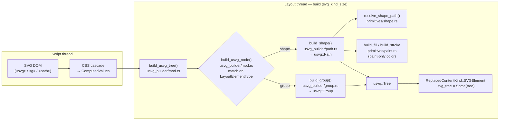
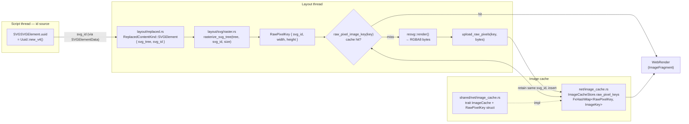
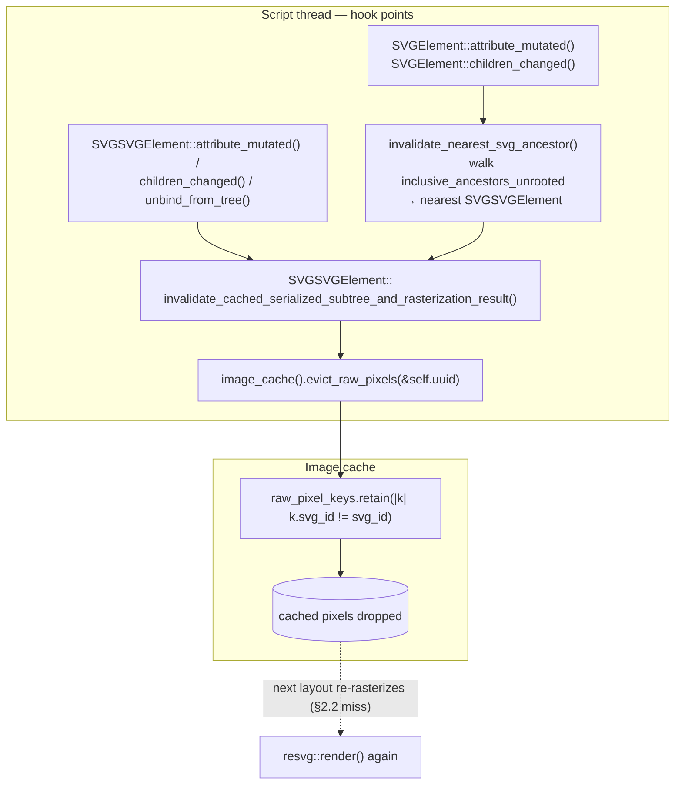
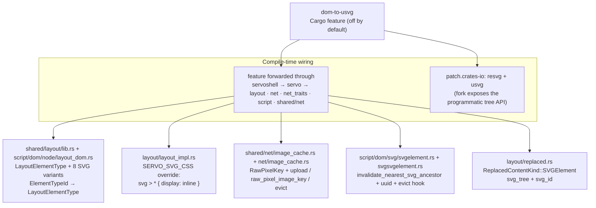
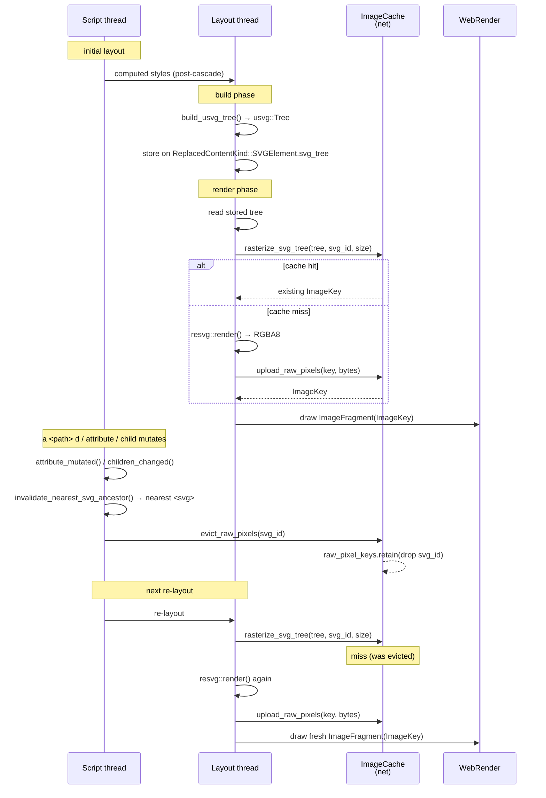

# Guide: the `usvg-basic-path` renderer (commit `4860b3ef`)

A walkthrough of the "Phase 2" basic-path SVG renderer, for use while splitting
it into focused PRs. Covers the architecture, every file it touches, the
non-obvious details, and a commit-by-commit split plan.

---

## 1. The mental model in one paragraph

Normally Servo renders an `<svg>` by serializing the DOM back to XML and feeding
it through a `vector_image`/resvg cache pipeline. That pipeline only sees
**presentation attributes** (raw `fill="red"`), so it cannot honor CSS —
`svg path { fill: blue }` or `style="..."` don't apply.

This commit replaces that (for basic shapes) with a **new path that walks the
DOM on the layout thread, where computed styles are available**, builds a
`usvg::Tree` programmatically via resvg's public constructors, and rasterizes it
**synchronously** to raw pixels uploaded straight to WebRender. The result: the
CSS cascade applies to SVG for the first time.

Everything is gated behind a new off-by-default Cargo feature `dom-to-usvg`.

---

## 2. The data flow (with `dom-to-usvg` enabled)

The tree is **built** and **rasterized** in two separate phases: the build
happens during replaced-content sizing and stores the `usvg::Tree` on the
element; the render phase later reads that stored tree back and rasterizes it.
So the two halves are shown as separate diagrams — there is no direct
`build → rasterize` call.

The parts that live **outside** `components/layout/svg/` are just as important:
three cross-crate fixes — **cache** (§2.2), **evict + invalidate** (§2.3) — plus
the feature plumbing that threads `dom-to-usvg` through the crate graph (§2.4).
Each gets its own diagram below.

### 2.1 Build phase — DOM → `usvg::Tree`



The tree is **not** rasterized here — it is stashed on the replaced content
and picked up later.

### 2.2 Render + cache — `usvg::Tree` → WebRender pixels (layout + net)

**Fix #1: the cache.** `rasterize_svg_tree` keys the raster by a `RawPixelKey`
built from the `<svg>`'s stable `Uuid` (not a DOM node id), so two layouts of
the same `<svg>` at the same size share one entry — and a re-render updates it
in place rather than leaking a new key.



### 2.3 Invalidation + eviction — the refresh cycle (script + net)

**Fix #2 (evict) + fix #3 (invalidate).** A mutation anywhere inside the SVG
walks up to the nearest `<svg>` and evicts its cached pixels, so the next
layout takes the §2.2 miss path and re-rasterizes. Two entry points — the
`<svg>`'s own hooks, and the descendant walk — converge on the same eviction
call.



The `Uuid` is the linchpin: it is generated once per `<svg>` element
(`Uuid::new_v4()` in `SVGSVGElement::new`), flows through `SVGElementData` into
`ReplacedContentKind::SVGElement.svg_id`, and names the `RawPixelKey` on the
layout side — so the script thread's `evict_raw_pixels(&self.uuid)` drops
exactly the pixels that layout will look up.

### 2.4 Feature plumbing — everything else touched outside `layout/svg`



| Change | File (outside `layout/svg`) | Feeds |
|---|---|---|
| `LayoutElementType` variants + `ElementTypeId` mapping | `shared/layout/lib.rs`, `script/dom/node/layout_dom.rs` | §2.1 (dispatch) |
| `svg > * { display: inline }` override | `layout/layout_impl.rs` | §2.1 (children get boxes) |
| `ReplacedContentKind::SVGElement` + `svg_tree`/`svg_id` | `layout/replaced.rs` | §2.2 (render) |
| `RawPixelKey` + 3 trait methods | `shared/net/image_cache.rs` | §2.2 (cache key) |
| `raw_pixel_keys` map + impl | `net/image_cache.rs` | §2.2/§2.3 (cache + evict) |
| `invalidate_nearest_svg_ancestor` | `script/dom/svg/svgelement.rs` | §2.3 (invalidate) |
| `uuid` field + `evict_raw_pixels` hook | `script/dom/svg/svgsvgelement.rs` | §2.3 (evict) |

### 2.5 End-to-end lifecycle — the four threads

The same story in one diagram, with one vertical line per participant (script,
layout, image cache, WebRender). Read top-to-bottom: build stashes the tree,
render rasterizes through the cache, a mutation evicts, and the next layout
re-rasterizes.



Two consequences of this flow:

1. **Computed styles are the source of truth.** Geometry/fill/stroke are read
   from `ComputedValues` (post-cascade), so the CSS cascade applies to SVG for
   the first time — `svg path { fill: blue }` and `style="…"` both work.
2. **No `vector_image` cache.** The result is rasterized synchronously on the
   layout thread and handed to WebRender. Caching is keyed by `RawPixelKey`
   (`Uuid` + size), and a DOM mutation invalidates the nearest `<svg>`'s cached
   pixels via `evict_raw_pixels` — so the same `<svg>` re-rasterizes only when
   it (or a descendant) actually changed.

---

## 3. The layering (`components/layout/svg/`)

Dependencies flow strictly downward:

```
usvg_builder/   → entry point + per-element assembly (dispatches, builds nodes)
  primitives/   → leaf parsing/geometry/paint, no builder knowledge
  raster.rs     → final rasterization into WebRender pixels
```

### `svg/mod.rs`

Module declarations and re-exports of the two public entry points:

```rust
pub(crate) use raster::rasterize_svg_tree;
pub(crate) use usvg_builder::build_usvg_tree;
```

### `svg/primitives/` — the "pure" leaf layer

**`attrs.rs`** — attribute/value reading helpers:

- `element_id()` — the `id` attribute (becomes the usvg node id).
- `element_layout_type()` — the canonical `LayoutElementType` discriminator
  (used instead of tag-name string matching).
- `number_attr` / `length_attr` / `length_attr_opt` / `parse_length_attr` —
  parse numeric/length attributes, stripping a `px` suffix.
- `lp_to_f32` / `lp_or_auto_to_f32` — convert Servo `LengthPercentage` /
  `NonNegativeLengthPercentageOrAuto` to `f32` px (or `None` for `auto`).
- `is_group_element()` — `SVGSVGElement | SVGGElement` are containers.
- `resolve_size()` — reads `width`/`height`, defaults to 100×100.

**`geometry.rs`** — pure path math, Servo-free (the only unit-testable leaf):

- `normalized_diagonal(size)` = √(w²+h²)/√2 — the SVG reference length for
  `<percentage>` stroke-width/dash values.
- `polygon_points(value, close)` — parses a `points` list into a path via
  `svgtypes::PointsParser`.
- `rounded_rect(...)` + `arc_to(...)` — builds a rounded rect using
  `kurbo::Arc::from_svg_arc` for the corner arcs (correct 90° arc→cubic
  conversion, mirroring usvg's own `convert_rect`).
- `parse_path_d(d)` — parses the `d` attribute via
  `svgtypes::SimplifyingPathParser` (the same parser usvg uses), which resolves
  relative→absolute, `S`/`T` reflection, `H`/`V`→`L`, and `A` arcs→cubics.

**`shape.rs`** — `resolve_shape_path(element, ty, computed)` — one arm per shape.
This is the geometry heart:

- `SVGRectElement` — `x/y/rx/ry` from computed style (or attributes),
  `width/height` always from attributes. Clamps `rx/ry` to half the box; handles
  the "one radius specified" SVG rule.
- `SVGCircleElement` — `cx/cy/r` (computed or attribute), `push_circle`.
- `SVGEllipseElement` — `cx/cy/rx/ry`, `push_oval`.
- `SVGLineElement` — `x1/y1/x2/y2` from attributes only (these aren't CSS
  longhands).
- `SVGPolylineElement` / `SVGPolygonElement` — `points` attribute →
  `polygon_points`.
- `SVGPathElement` — `d` attribute → `parse_path_d`.

**`paint.rs`** — maps computed `fill`/`stroke` to usvg paint:

- `build_fill(computed)` — reads `fill`, `fill-opacity`, `fill-rule`. Folds the
  fill color's own alpha channel into `fill-opacity` (because `usvg::Paint::Color`
  is RGB-only — see §6 gotcha #3).
- `build_stroke(computed, diagonal)` — reads `stroke`, `stroke-opacity`,
  `stroke-width`, `stroke-linecap`, `stroke-linejoin`, `stroke-miterlimit`,
  `stroke-dasharray`, `stroke-dashoffset`. Resolves `<percentage>` widths/dashes
  against `diagonal`. Replicates usvg's odd-length dasharray doubling.
- `resolve_paint(svg_paint, computed)` — handles **only** `SVGPaintKind::Color`
  and `SVGPaintKind::None`. Paint servers (`url(#...)` gradients/patterns) hit the
  `_ => None` arm — deferred to a later phase.

### `svg/usvg_builder/` — the assembly layer

**`mod.rs`** — orchestration + context:

- `SvgContext { context: &LayoutContext, diagonal: f32 }` with two methods:
  - `computed_style(element)` → `Option<Arc<ComputedValues>>` (None when
    unstyled).
  - `opacity(computed)` → the element's group opacity.
- `build_usvg_tree(node, context) -> Option<usvg::Tree>` — the entry point.
  Checks the node is `SVGSVGElement`, resolves size, computes the diagonal,
  creates the context, walks all DOM children into a root `usvg::Group`, then
  `tree.finalize()`.
- `build_usvg_node(node, ctx) -> Vec<usvg::Node>` — the dispatcher. Group-like
  elements → `build_group`; everything else → `build_shape`. Returns a `Vec`
  because a shape with opacity < 1 returns a carrying group.

**`path.rs`** — `build_shape(element, ty, computed, ctx)`:

1. `resolve_shape_path` → geometry (or bail).
2. Reads `id`, `visibility`, `fill`, `stroke` from computed style.
3. Constructs `usvg::Path::new(...)` with `usvg::Transform::identity()` (no
   transforms in this phase).
4. If element opacity < 1.0, wraps the path in a `usvg::Group` carrying that
   opacity.

**`group.rs`** — `build_group(node, ctx)`:

- Creates a `usvg::Group`, sets its `id` and `opacity`, recurses into children
  via `build_usvg_node`.

### `svg/raster.rs`

`rasterize_svg_tree(image_cache, tree, node, raster_size) -> Option<ImageKey>`:

- Clamps size to ≤ 5000px, makes a `tiny_skia::Pixmap`.
- Applies a **non-uniform scale** from the tree's natural size to the raster size
  (no `viewBox` in this phase).
- `resvg::render(...)` → `pixmap.take()` → RGBA8 bytes.
- Hashes `(node.id(), width, height)` and calls
  `image_cache.upload_raw_pixels(hash, bytes, width, height)`, then returns
  `image_cache.raw_pixel_image_key(hash)`.

---

## 4. Layout integration — `components/layout/replaced.rs`

Where the new path hooks into layout's replaced-content machinery:

- **`ReplacedContentKind::SVGElement`** gains a gated field
  `svg_tree: Option<Arc<usvg::Tree>>` (with `#[conditional_malloc_size_of]` so it
  is only measured when the type is `MallocSizeOf`).
- **`svg_kind_size`** (the constructor path): after computing the natural size,
  it calls `build_usvg_tree(node, context)` and stores the result.
- **The render arm**: if `svg_tree` is present, it rasterizes via
  `rasterize_svg_tree` and returns an `ImageFragment` with the resulting
  `ImageKey`. The legacy `vector_image` cache path is kept as a fallback (only
  reached when the tree is `None`, e.g. non-`<svg>` nodes).

Every gate is `#[cfg(feature = "dom-to-usvg")]` — with the feature off, this code
compiles away and the file behaves exactly as upstream.

---

## 5. The plumbing (why this touches so many crates)

The renderer is ~750 lines, but the feature must be threaded through Servo's
crate graph. Every Cargo.toml change below just forwards the `dom-to-usvg`
feature so it reaches the `cfg` gates.

**Feature flag chain** (all `dom-to-usvg = [...]`):

- `ports/servoshell/Cargo.toml` → `servo/dom-to-usvg`
- `components/servo/Cargo.toml` → `layout/dom-to-usvg` + `net/dom-to-usvg`
- `components/layout/Cargo.toml` → `dep:resvg`, `dep:svgtypes`, `dep:html5ever`,
  `script/dom-to-usvg`, `net_traits/dom-to-usvg`
- `components/net/Cargo.toml` → `net_traits/dom-to-usvg`
- `components/script/Cargo.toml` → `dom-to-usvg = []` (local gate)
- `components/shared/net/Cargo.toml` → `dom-to-usvg = []`

**Root `Cargo.toml`**:

- Adds `svgtypes = "0.16.1"` as a workspace dependency.
- Adds a `[patch.crates-io]` replacing `resvg` and `usvg` with
  `mu-mostafa98/resvg` branch `usvg-for-servo` — this fork exposes the
  **programmatic tree-building API** (public constructors + `finalize()`).
  Without it, `usvg::Tree` can't be built by hand. **This is the critical
  external dependency the whole PR hinges on.**

**Style — `layout_impl.rs`**: upstream `servo.css` contains
`svg > * { display: none; }`, which would make every SVG child invisible (no
box, so no computed style for the builder to read). With the feature on, this
appends an override stylesheet `svg > * { display: inline; }` *after*
`servo.css`, so it wins the cascade and SVG children get real computed styles.

**Script-side invalidation — `svgelement.rs` + `svgsvgelement.rs`**: because the
tree is built on the layout thread and cached by node id, a DOM mutation deep
inside the SVG must force a re-raster.
`SVGElement::invalidate_nearest_svg_ancestor()` walks ancestors to the nearest
`SVGSVGElement` and calls its
`invalidate_cached_serialized_subtree_and_rasterization_result()` (visibility
widened from `fn` to `pub(crate)`). This is hooked into `attribute_mutated` and
`children_changed`.

**Type mapping — `shared/layout/lib.rs` + `script/dom/node/layout_dom.rs`**:
layout discriminates elements by `LayoutElementType`, not tag names. The commit
adds 8 variants to the enum (`SVGCircleElement`, `SVGEllipseElement`,
`SVGGElement`, `SVGLineElement`, `SVGPathElement`, `SVGPolygonElement`,
`SVGPolylineElement`, `SVGRectElement`) and maps the script-side
`ElementTypeId`s to them in `From<ElementTypeIdWrapper> for LayoutElementType`.

**Image cache — `shared/net/image_cache.rs` (trait) + `net/image_cache.rs`
(impl)**: two gated methods `upload_raw_pixels(hash, data, w, h)` and
`raw_pixel_image_key(hash)`. The impl builds a minimal `RasterImage`, reuses the
existing upload path to push pixels to WebRender, and stores the key in a new
`raw_pixel_keys: FxHashMap<u64, WebRenderImageKey>`. On a re-upload of the same
hash (a mutated SVG re-laid-out) it refreshes the pixels *in place* via
`update_image` rather than leaking a new key.

---

## 6. Key gotchas / non-obvious points

1. **`svg > * { display: none }` is the whole reason for the style override.**
   Without `display: inline` the children never get boxes, so `computed_style()`
   returns nothing and the builder has no geometry to read.

2. **`usvg::Paint::Color` is RGB-only.** An alpha-carrying fill
   (`fill="rgba(..., .4)"`) would silently drop its alpha unless folded into
   `fill-opacity`/`stroke-opacity`. `resolve_paint` returns `(paint, alpha)` and
   `build_fill`/`build_stroke` multiply that alpha into the opacity.

3. **Odd-length dash arrays must be doubled.** `tiny_skia_path::StrokeDash::new`
   rejects odd lists; usvg's XML parser does the doubling, so the programmatic
   path must replicate it, or a dashed stroke renders solid.

4. **`normalized_diagonal` is the `%` reference.** It exists *only* for
   percentage stroke-width/dash values. This is the one thing that becomes dead
   code if stroke is split into its own commit — drop it in the fill-only commits
   and re-add it with stroke.

5. **Rasterization is synchronous on the layout thread.** This deliberately
   bypasses the async `vector_image` cache, at the cost of a synchronous
   `resvg::render` on layout. The comment in `replaced.rs` frames this as
   intentional for this phase.

6. **The `resvg`/`usvg` patch is a hard prerequisite.** No upstream `usvg`
   0.48.1 can build a `Tree` programmatically. Any PR that lands this code must
   also land (or reference) the fork.

---

## 7. Map to the 4-commit/PR split

| Commit | Scope | Key files |
|---|---|---|
| **1. Plumbing** | feature flag + image cache + invalidation + type mapping | all Cargo.toml, `layout_impl.rs`, `net/image_cache.rs`, `shared/net/image_cache.rs`, `shared/layout/lib.rs`, `layout_dom.rs`, `svgelement.rs`, `svgsvgelement.rs` |
| **2. `<path>` + fill** | minimal end-to-end path renderer | `svg/mod.rs`, `usvg_builder/{mod,path,group}.rs`, `primitives/{mod,attrs,paint}.rs`, `geometry.rs` (just `parse_path_d`), `raster.rs`, `replaced.rs` |
| **3. Other 6 shapes + fill** | rect/circle/ellipse/line/polyline/polygon | `shape.rs`, `geometry.rs` (`polygon_points`, `rounded_rect`, `arc_to`), the remaining `layout_dom.rs` arms |
| **4. Stroke for all 7** | `build_stroke` + `normalized_diagonal` | `paint.rs`, `geometry.rs`, wire into `build_shape` |

The seams line up with the code: `build_fill`/`build_stroke` are already separate
functions, and `resolve_shape_path` has one arm per shape — so splitting along
these lines doesn't require rearchitecting, just staging.
