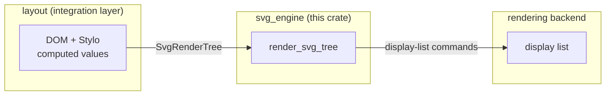
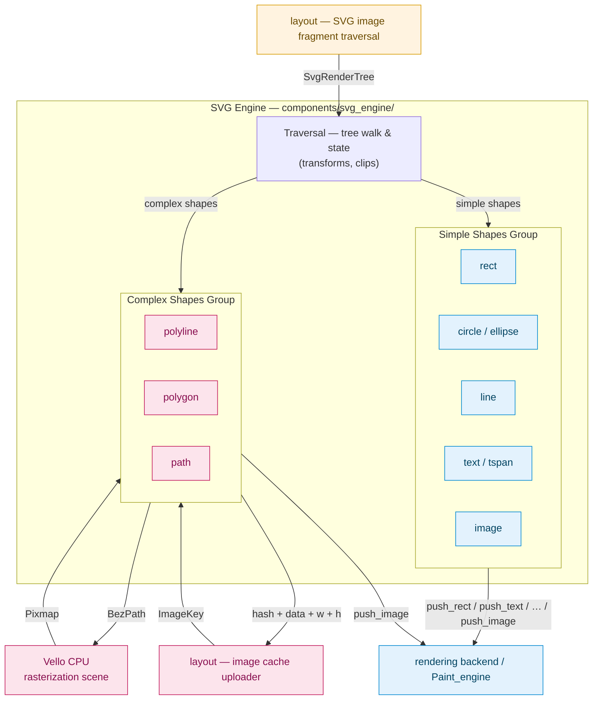
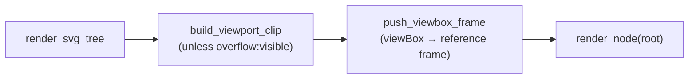
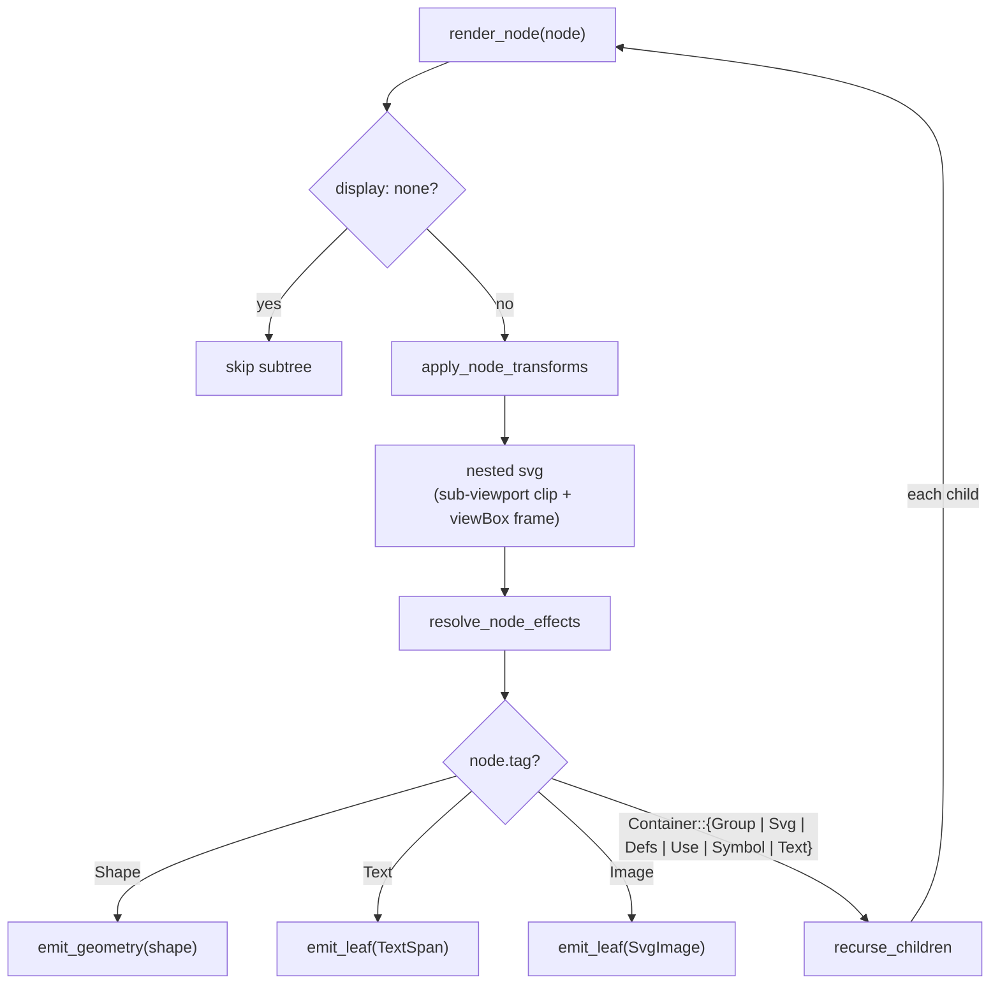
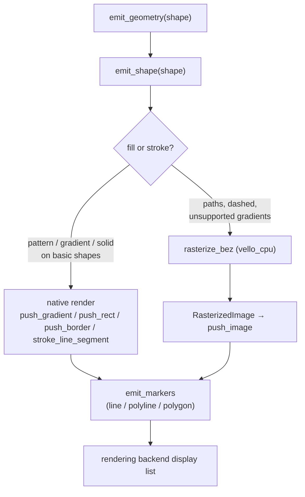
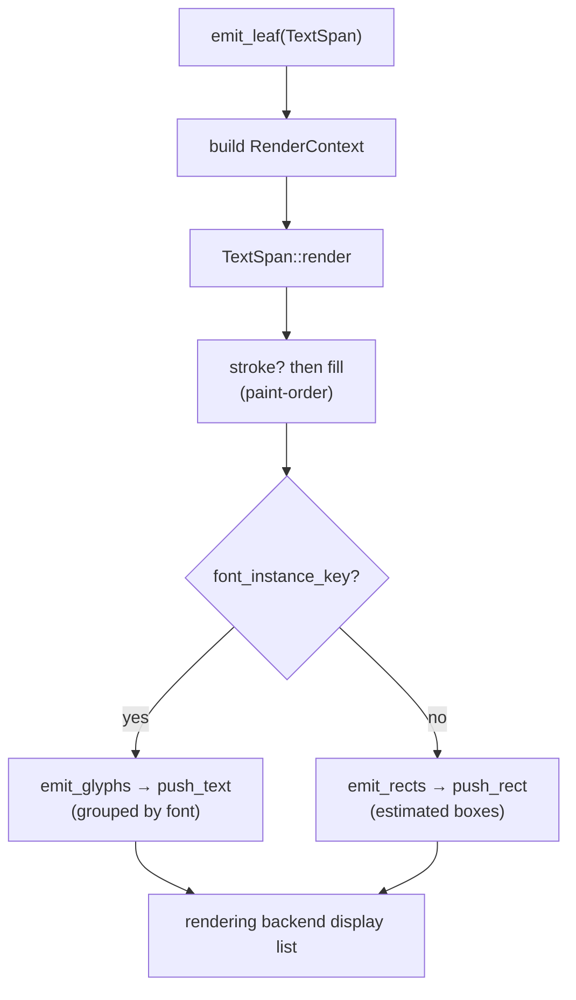
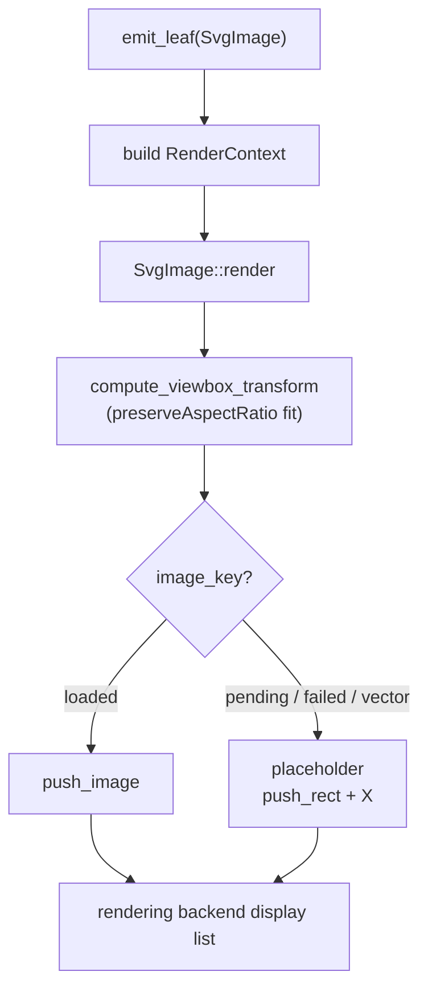

# SVG Rendering Pipeline — `svg_engine`

## 1. Overview

The SVG rendering pipeline: converts `<svg>` embedded in HTML into
rendering backend display-list commands.

## 2. Design

Rendering SVG is split into two stages with a single, well-defined
boundary: the document is converted into a data structure first, and that data
structure is then turned into drawing commands. The first stage lives in
`layout`; the second is this crate.

**1. Integration layer — `DOM` → `SvgRenderTree` (in `layout`)**

The `layout` crate owns the boundary between the document and the renderer. Its
`build_svg_render_tree` entry point walks the SVG subtree, resolves CSS
computed values, and collects the `<defs>` resources (gradients, patterns,
and markers) into a pure-data `SvgRenderTree`. The
result is a tree of `SvgRenderNode`s carrying only the geometry and paint
information the renderer needs — no DOM or layout types leak through.

**2. The engine — `SvgRenderTree` → display commands (in `svg_engine`)**

This crate's core is `render_svg_tree`, which walks the `SvgRenderTree`
recursively and emits a rendering backend display list. At each node it resolves the
inherited transforms, effects, and paint, then produces the matching primitive.
Shapes are emitted through one of two paths: a native path that pushes
rendering backend items directly (`push_rect`, `push_border`, `push_gradient`,
`push_text`, `push_image`) for shapes the rendering backend can express natively, and a
software path that rasterizes the shape with `vello_cpu` into a
`RasterizedImage` and pushes it as a single image. The split exists because
the rendering backend cannot natively express arbitrary paths and certain border and
gradient cases, so those fall back to CPU rasterization.

## 3. Input, process, output

At the top level the engine takes an `SvgRenderTree` (built from the DOM by
`layout::svg::build_svg_render_tree`), walks it recursively, and emits rendering backend
display-list commands — native primitives (`push_rect`, `push_border`,
`push_gradient`, `push_text`, `push_image`) for shapes the rendering backend can express
directly, or a `push_image` of a `RasterizedImage` rasterized by `vello_cpu`
(`RasterSink::emit`) for everything else. The table below breaks that down per
SVG element.

| Input | Processing | Output |
|-------|------------|--------|
| `<rect>` | Fill / stroke / gradient painted into its bounds; `rx`/`ry` corner radii become a rounded-rect clip chain | `push_rect` / `push_border` / `push_gradient` |
| `<circle>` | Delegates to `<ellipse>` (→ `<rect>`): converted to a rect with `rx = ry = r` | `push_rect` / `push_border` / `push_gradient` |
| `<ellipse>` | Delegates to `<rect>`: converted to a rect with `rx`/`ry` radii | `push_rect` / `push_border` / `push_gradient` |
| `<line>` | Solid/gradient stroke emitted as a rotated segment | `stroke_line_segment` |
| `<path>` | Converted to a `BezPath`, then `vello_cpu` rasterizes it into an RGBA pixmap | `RasterizedImage` → `push_image` |
| `<polyline>` | Converted to an open `BezPath`, then `vello_cpu` rasterizes it into an RGBA pixmap | `RasterizedImage` → `push_image` |
| `<polygon>` | Converted to a closed `BezPath`, then `vello_cpu` rasterizes it into an RGBA pixmap | `RasterizedImage` → `push_image` |
| `<image>` | `href` resolved to an `ImageKey` at build time; `preserveAspectRatio` fits the natural size into the viewport, then drawn with `push_image` (gray placeholder if not loaded) | `push_image` |
| `<text>` | Applies `text-anchor`/RTL alignment and fill/stroke, then emits glyphs grouped by font | `push_text` |
| `<tspan>` | Applies fill/stroke and emits its glyphs inline within the `<text>` line | `push_text` |
| `<pattern>` | Paint server (`fill`/`stroke`): content tiled across the host shape via `fill_rect_with_pattern_by_id`, shapes filled with `lyon` tessellation | native primitives (`push_rect` / `push_gradient`) |
| `<marker>` | Referenced by `marker-start`/`marker-mid`/`marker-end` on `line`/`polyline`/`polygon`/`path`: content placed at each vertex, scaled by `markerWidth`/`markerHeight` and rotated along the tangent | `RasterizedImage` → `push_image` (`vello_cpu`) |

## 4. Scope

**Scope in one line:** v0 renders a fixed whitelist of trusted, static SVG
elements for pre-validated, author-controlled input. Adversarial and malicious
SVG are explicitly out of scope; the engine is not a security boundary.

**Biggest feature — CSS cascade and external styles.** Styles are resolved
through Stylo's `ComputedValues`, so external stylesheets, inheritance, and the
full cascade apply to SVG exactly as they do to HTML. The old pipeline
serialized the `<svg>` subtree to a string and rasterized it into a single
bitmap, so it could only preserve inline presentation attributes.

**Supported elements — attribute whitelist.** The table below is the v0
whitelist: an element is in scope only if it appears here, and only the
attributes listed for it are guaranteed to work. Use it as the checklist for
testing.

All shape, text, and image elements also accept the common presentation
attributes: `fill`, `fill-opacity`, `fill-rule`, `stroke`, `stroke-width`,
`stroke-opacity`, `stroke-linecap`, `stroke-linejoin`, `stroke-miterlimit`,
`stroke-dasharray`, `stroke-dashoffset`, `opacity`, `visibility`, `display`,
`transform` (attribute and CSS `transform`), `filter`, `clip-path`, `mask`,
`marker-start`, `marker-mid`, `marker-end`, and `vector-effect`
(`non-scaling-stroke`).

| Category | Element | Working attributes |
|----------|---------|--------------------|
| Shape | `<rect>` | `x`, `y`, `width`, `height`, `rx`, `ry` |
| Shape | `<circle>` | `cx`, `cy`, `r` |
| Shape | `<ellipse>` | `cx`, `cy`, `rx`, `ry` |
| Shape | `<line>` | `x1`, `y1`, `x2`, `y2` |
| Shape | `<polyline>` | `points` |
| Shape | `<polygon>` | `points` |
| Shape | `<path>` | `d` |
| Structure | `<svg>` (nested) | `x`, `y`, `width`, `height`, `viewBox`, `preserveAspectRatio`, `overflow` (root `<svg>` is sized by CSS/layout) |
| Structure | `<g>` | — (groups children) |
| Structure | `<defs>` | — (children referenced, not rendered directly) |
| Structure | `<use>` | `href` / `xlink:href`, `x`, `y`, `width` / `height` (for `<symbol>` targets) |
| Structure | `<symbol>` | `viewBox`, `preserveAspectRatio`, `width`, `height` |
| Paint | `<linearGradient>` | `x1`, `y1`, `x2`, `y2`, `gradientUnits`, `gradientTransform`, `spreadMethod` |
| Paint | `<radialGradient>` | `cx`, `cy`, `r`, `fx`, `fy`, `gradientUnits`, `gradientTransform`, `spreadMethod` |
| Paint | `<stop>` | `offset`, `stop-color`, `stop-opacity` |
| Paint | `<pattern>` | `x`, `y`, `width`, `height`, `patternUnits`, `patternContentUnits`, `patternTransform`, `viewBox`, `preserveAspectRatio` |
| Effect | `<clipPath>` | `clipPathUnits` |
| Effect | `<mask>` | — (masking shapes are its children) |
| Effect | `<filter>` | `x`, `y`, `width`, `height` |
| Effect | `<feGaussianBlur>` | `stdDeviation` |
| Effect | `<feDropShadow>` | `dx`, `dy`, `stdDeviation`, `flood-color`, `flood-opacity` |
| Effect | `<feColorMatrix>` | `type`, `values` |
| Effect | `<feOffset>` | `dx`, `dy` |
| Effect | `<feFlood>` | `flood-color`, `flood-opacity` |
| Effect | `<feComposite>` | `operator`, `k1`–`k4` *(recognized, renders as no-op)* |
| Effect | `<feTile>` | — *(recognized, renders as no-op)* |
| Effect | `<feImage>` | `href` / `xlink:href` *(recognized, renders as no-op)* |
| Text | `<text>` | `x`, `y`, `dx`, `dy`, `rotate`, `text-anchor`, `dominant-baseline`, `direction` |
| Text | `<tspan>` | `x`, `y`, `dx`, `dy`, `rotate`, `text-anchor`, `dominant-baseline`, `direction` |
| Image | `<image>` | `x`, `y`, `width`, `height`, `href` / `xlink:href`, `preserveAspectRatio` |
| Marker | `<marker>` | `viewBox`, `refX`, `refY`, `markerWidth`, `markerHeight`, `markerUnits`, `orient`, `preserveAspectRatio` |

**Out of scope — adversarial and malicious SVG.** The whitelist applies to
trusted, author-controlled, pre-validated input only. Adversarial SVG — crafted
to exploit, overload, crash, hang, exhaust, bypass, or abuse the engine or its
host — is out of scope:

- **Resource exhaustion** — huge canvas/`viewBox`, deep nesting, `<use>`/`<defs>`
  amplification, billion-laughs.
- **Parser attacks** — DTDs, external entities, malformed/oversized input.
- **Active content** — scripts, event handlers, `javascript:` URLs, animation.
- **External resource access / data exfiltration** — remote images/fonts/CSS,
  network fetches, external URLs, local file inclusion.
- **Rendering bombs** — recursive paint servers/markers, extreme stroke/dash
  values, excessive element counts.

The engine is **not a security boundary**: no guarantee it terminates, stays
within memory/CPU bounds, avoids panics/stack-overflow/OOM, or preserves host
integrity. Excluding adversarial input is the caller's responsibility; the
engine **must not** be exposed to untrusted input (user uploads, multi-tenant,
network-facing) unless the deployer provides that exclusion.

**Constraints**

- **GPU Native first, CPU rasterization via `vello_cpu` fallback.** The goal is to render every shape
  natively through the rendering backend; cases the backend cannot express yet
  (arbitrary paths, and some border/gradient cases) fall back to CPU
  rasterization via `vello_cpu`.
- **No incremental updates or animation yet.** The `SvgRenderTree` and its display
  list are rebuilt only when the SVG fragment is dirtied — that is, when some element
  inside the SVG (or a style affecting it) changes — not on every page reflow. When a
  rebuild does happen it is a full rebuild: incremental updates and animation are not
  implemented. Unlike the old pipeline, there is no architectural blocker — the tree
  is already reflowable data, so both can be added later.

## 5. Implementation

### 5.1 System boundaries

`svg_engine` exposes a single interface — `render_svg_tree` — which takes an
`SvgRenderTree` and emits a rendering backend display list.

### 5.2 Architecture

One traversal fans out into two rendering paths: simple shapes are pushed to
the rendering backend natively, and complex shapes are rasterized through `vello_cpu` and
uploaded as images.

### 5.3 Module map

| Module | Responsibility |
|--------|----------------|
| [`render_tree`](src/render_tree.rs) | Data model — tree and node types |
| [`shapes`](src/shapes/mod.rs) | Data model — shape types |
| [`style`](src/style/mod.rs) | Data model — paint and style parameters |
| [`text`](src/text.rs) | Data model — text |
| [`image`](src/image.rs) | Data model — image |
| [`traversal`](src/traversal.rs) | recursive walk |
| [`renderer`](src/renderer/mod.rs) | shape rendering |

### 5.4 Data flow

Rendering is a single recursive pass: `render_svg_tree` sets up the root
viewport, walks every node, and each shape's paint is pushed natively or
rasterized through `vello_cpu`.

#### 5.4.1 Viewport setup

`render_svg_tree` first clips the root viewport and maps `viewBox` into a
reference frame, then starts the walk at the root node.

#### 5.4.2 The node walk

`render_node` applies transforms and effects, then dispatches on the node tag:
`Shape` → `emit_geometry`, `Text` / `Image` → `emit_leaf`, and `Container` →
`recurse_children` (which walks each child back through `render_node`). A nested
`<svg>` also pushes a sub-viewport clip and `viewBox` frame before recursing.

#### 5.4.3 Shapes

The node walk hands `Shape` to `emit_geometry`, which wraps the paint in
effects and delegates to `emit_shape`. `emit_shape` resolves the paint to a
native primitive or a `vello_cpu` raster; markers (`emit_markers`) are emitted
afterward on line/polyline/polygon shapes.

#### 5.4.4 Text

The node walk hands `Text` to `emit_leaf`, which builds a `RenderContext` and
calls `TextSpan::render`. Real glyphs are drawn with `push_text` when a
`FontInstanceKey` is available; otherwise estimated rectangles are drawn as a
fallback.

#### 5.4.5 Image

The node walk hands `Image` to `emit_leaf`, which builds a `RenderContext` and
calls `SvgImage::render`. A loaded image is drawn with `push_image` (fitted via
`preserveAspectRatio`); otherwise a placeholder (gray rect with an X) is drawn.

## 6. Dependencies and build impact

Dependencies declared in [Cargo.toml](Cargo.toml):

| Library | Usage |
|---------|-------|
| `euclid` | Affine transforms (`Transform2D`) for node/viewBox/gradient/pattern/marker matrices, plus the `Point2D`/`Rect`/`Size`/`Vector2D` primitives behind layout coordinates |
| `kurbo` | Path representation: `BezPath` (every shape via `to_bez_path`), `Stroke` + dash handling, `Affine`, and `PathEl` — the format handed to `vello_cpu` and the basis of `ComplexClip` geometry |
| `lyon` | Polygon tessellation: `FillTessellator` triangulates polygons into triangles emitted as per-scanline `push_rect` bands, used to fill shapes inside `<pattern>` content |
| `svgtypes` | Spec-compliant SVG parsing: `Length`/`LengthUnit`, `PointsParser`, `ViewBox`, `Color`, and `TransformListParser` — backing `attr_parsers`, `render_tree`, `transform_ops` |
| `vello_cpu` | Software rasterization — takes a `BezPath` and produces an RGBA `Pixmap` |

`euclid`, `kurbo`, and `vello_cpu` are already dependencies of existing
components (the canvas and layout crates); the engine introduces only two new
third-party crates — `lyon` (polygon tessellation) and `svgtypes` (SVG value
parsing).

**Build-system impact**

- `svg_engine` is a **workspace member** (listed in the root `Cargo.toml`),
  published at `components/svg_engine`.
- No build bootstrap, feature-unification, or build-script changes are
  introduced — the added crates are pure Rust libraries.
- `vello_cpu` is enabled with the `multithreading` feature in the workspace pin.

## 7. Public API

| API | Description | Input parameters | Return type |
|-----|-------------|------------------|-------------|
| `build_svg_render_tree` (components/layout/svg) | Builds the `SvgRenderTree` from the DOM subtree and resolved CSS values. | `node: ServoLayoutNode<'dom>`, `context: &LayoutContext` | `Option<Arc<SvgRenderTree>>` |
| `render_svg_tree` (components/svg_engine) | Renders an entire `SvgRenderTree` into a rendering backend display list. | `tree: &SvgRenderTree`, `svg_origin: &LayoutPoint`, `svg_size: LayoutSize`, `device_scale: f32`, `spatial_id: SpatialId`, `clip_chain_id: ClipChainId`, `sink: &RasterSink`, `wr: &mut DisplayListBuilder` | No return — pushes display commands directly into `wr` (`&mut DisplayListBuilder`) |

## 8. Complexity and resource usage

The pipeline is linear in node count (`n` = SVG nodes); the only non-linear
factor is the area of shapes rendered through the software (`vello_cpu`) path.

### 8.1 Build tree — `build_svg_render_tree` (in `layout`)

| Sub-step | Time complexity | Memory |
|----------|----------------|--------|
| Walk the SVG DOM subtree | O(n) | O(1) |
| Resolve computed style per node (Stylo) | O(1) amortized / node | O(1) |
| Collect `<defs>` resources (gradients / patterns / markers) | O(defs) | O(defs) |
| Construct the `SvgRenderNode` tree | O(n) | O(n) |
| **Total** | **O(n)** | **O(n)** |

### 8.2 Traversal — `render_svg_tree` → `render_node`

| Sub-step | Time complexity | Memory |
|----------|----------------|--------|
| Recursive walk over `SvgRenderNode`s | O(n) | O(depth) |
| Apply transforms / resolve effects per node | O(1) | O(1) |
| Tag dispatch (`Shape` / `Text` / `Image` / `Container`) | O(1) | O(1) |
| Container recursion | O(children) → O(n) total | O(1) |
| Nested `<svg>` sub-viewport clip + viewBox frame | O(1) | O(1) |
| **Total** | **O(n)** | **O(depth)** |

### 8.3 Render — per node → display list

Rendering diverges into two paths with very different costs.

#### 8.3.1 Render paths

| Path | Applies to | Time complexity | Memory |
|------|-----------|----------------|--------|
| `push_rect` / `push_border` | `<rect>`, `<circle>`, `<ellipse>` fill + stroke | O(1) | none (GPU) |
| `push_gradient` | linear / radial gradient on basic shapes | O(1) | none (GPU) |
| `stroke_line_segment` | `<line>` | O(1) | none (GPU) |
| `push_text` | `<text>` / `<tspan>` glyphs | O(glyphs) | none (GPU) |
| `push_image` | `<image>` | O(1) | none (GPU) |
| `rasterize_bez` (`vello_cpu`) | `<path>`, `<polyline>`, `<polygon>`, dashed, unsupported gradients, patterns | O(segments) + O(pixels) | w × h × 4 bytes |

#### 8.3.2 Software path breakdown (`rasterize_bez`)

| Sub-step | Time complexity | Memory |
|----------|----------------|--------|
| Build `BezPath` | O(segments) | O(segments) |
| Tessellation (`lyon`) | O(v log v) | O(v) |
| Rasterization (`vello_cpu`) | O(pixels) | — |
| Pixmap allocation | O(1) | w × h × 4 bytes |
| Upload + `push_image` | O(pixels) | O(pixels) transient |

Pixel count is `bbox width × bbox height × device_pixel_ratio²`.

#### 8.3.3 Summary

| Category | Time complexity | Memory |
|----------|----------------|--------|
| Build tree | O(n) | O(n) |
| Traversal | O(n) | O(depth) |
| Render — native | O(n) total (O(1) / shape) | none (GPU) |
| Render — software | Σ (segments + pixels) per shape | Σ (area × DPR² × 4) |

## 9. `<use>` elements — expansion model and security

### 9.1 How `<use>` works

`<use>` is an **inline expansion at build time**, not a live reference: there is
no `<use>` primitive in the display list.

**Build time (in `layout`).** When `build_render_node` reaches a `<use>`
container, [`resolve_use_children`](../layout/svg/builder.rs) reads `href` /
`xlink:href`, strips the `#`, checks the reference against a `resolving`
path-set to break cycles, then resolves the target via `find_element_by_id`
and calls `build_render_node(target)` to **build a full fresh copy** of the
target subtree. The `<use>`'s `x`/`y` is applied as a leading `Translate`
transform, and `<symbol>` targets are wrapped in a viewport-carrying group. The
result is a `SvgRenderNode` `Group` whose children are a **materialized copy**
of the referenced content.

**Render time (in `svg_engine`).** The traversal treats `Container::Use` like a
`Group`: `render_node` → `recurse_children` → walk the cloned children, each of
which emits its normal commands (`push_rect` / `push_gradient` / `push_text`
natively, or a `vello_cpu` `push_image` for paths). The display commands for a
`<use>` are therefore the expanded target's commands, repeated once per `<use>`
instance.

### 9.2 `<use>` security issues

`<use>` can amplify a small document into a huge command stream because each
`<use>` **copies** the referenced subtree instead of **sharing** it. The planned
fix is a shared `defs` map (`id` → resolved subtree) that each `<use>` just
references.

**Known issues**

| # | Issue | Example (small SVG) | Fixed? |
|---|-------|---------------------|--------|
| 1 | Direct self-cycle (infinite recursion) | `<g id="a"><use href="#a"/></g>` | ✅ cycle detection |
| 2 | Indirect cycle (any length, loops back) | `<g id="l1"><use href="#l2"/></g>` `<g id="l2"><use href="#l3"/></g>` … `<g id="lN"><use href="#l1"/></g>` | ✅ cycle detection |
| 3 | Deep acyclic chain → stack overflow | `<g id="l0"><rect/></g>` `<g id="l1"><use href="#l0"/></g>` `<g id="l2"><use href="#l1"/></g>` … ×100k | ❌ no guard |
| 4 | Billion-laughs (exponential fan-out) | `<g id="l0"><rect/></g>` `<g id="l1"><use href="#l0"/><use href="#l0"/></g>` `<g id="l2"><use href="#l1"/><use href="#l1"/></g>` … ×30 levels | ❌ no guard |
| 5 | Quadratic blow-up | `<g id="l1"><rect/></g>` `<g id="l2"><use href="#l1"/><rect/></g>` `<g id="l3"><use href="#l2"/><rect/></g>` … ×10,000 levels | ❌ no guard |
| 6 | Command amplification (big-but-legit) | `<symbol id="icon">` … 1000 shapes … `</symbol>` `<use href="#icon" x="0"/>` … ×10,000 | ❌ no guard |

The `resolving` set is a **DFS path-set**, not a global visited-set: it breaks
cycles (rows 1–2) but deliberately re-expands sibling references, which is what
allows rows 4–5 to amplify. Each `<use>` is a full clone, so memory amplifies
along with time in rows 4–5 and 6.
