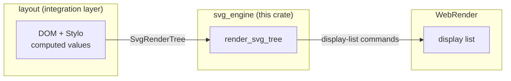
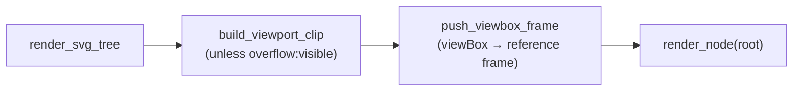
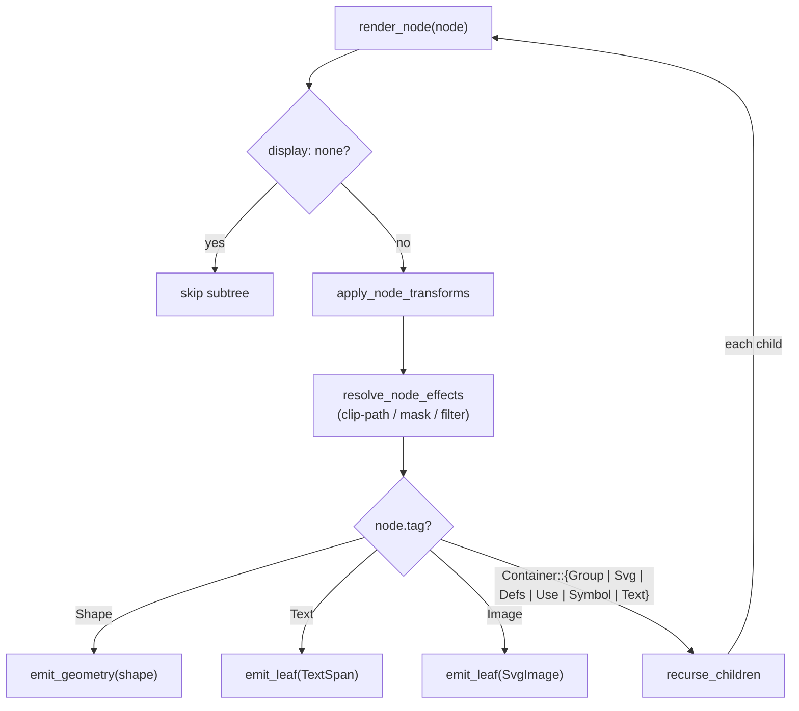
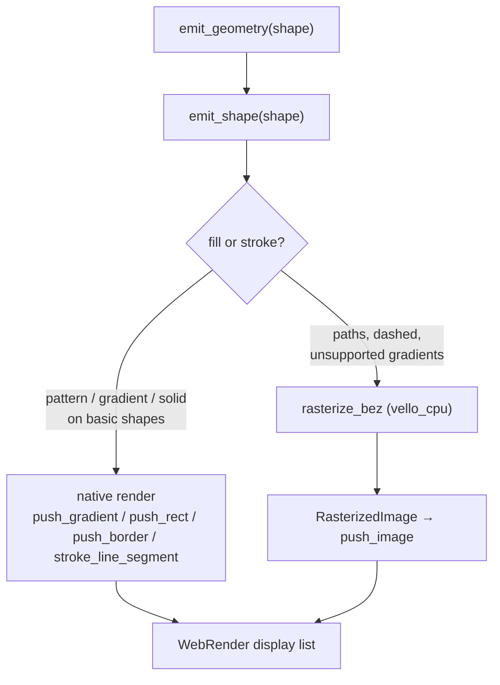
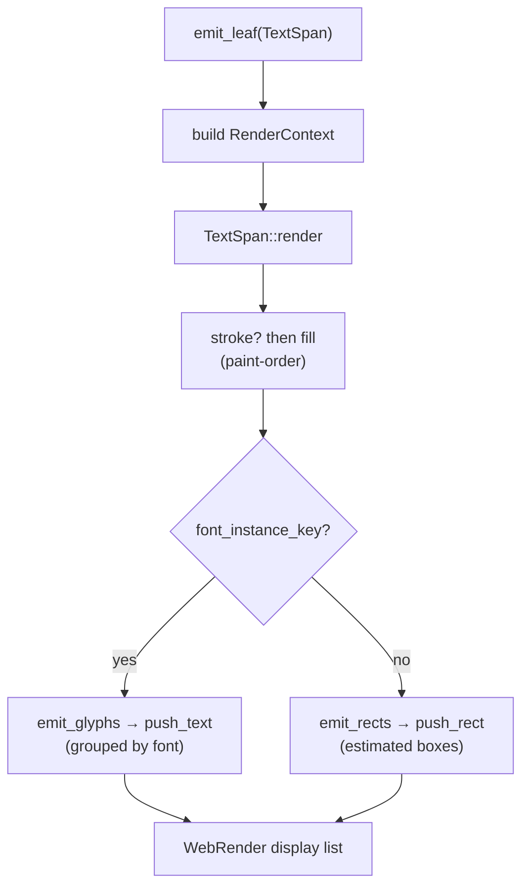
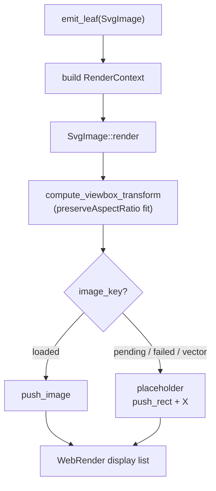

# `svg_engine` — Software SVG Render Engine

## 1. General description (one sentence)

The SVG rendering pipeline: converts `<svg>` embedded in HTML into
WebRender display-list commands.

## 2. General description of the design

Rendering SVG is split into two stages with a single, well-defined
boundary: the document is converted into a data structure first, and that data
structure is then turned into drawing commands. The first stage lives in
`layout`; the second is this crate.

**1. Integration layer — `DOM` → `SvgRenderTree` (in `layout`)**

The `layout` crate owns the boundary between the document and the renderer. Its
`build_svg_render_tree` entry point walks the SVG subtree, resolves CSS
computed values, and collects the `<defs>` resources (gradients, patterns,
clip-paths, masks, filters, and markers) into a pure-data `SvgRenderTree`. The
result is a tree of `SvgRenderNode`s carrying only the geometry and paint
information the renderer needs — no DOM or layout types leak through.

**2. The engine — `SvgRenderTree` → display commands (in `svg_engine`)**

This crate's core is `render_svg_tree`, which walks the `SvgRenderTree`
recursively and emits a WebRender display list. At each node it resolves the
inherited transforms, clips, and paint, then produces the matching primitive.
Shapes are emitted through one of two paths: a native path that pushes
WebRender items directly (`push_rect`, `push_border`, `push_gradient`,
`push_text`, `push_image`) for shapes WebRender can express natively, and a
software path that rasterizes the shape with `vello_cpu` into a
`RasterizedImage` and pushes it as a single image. The split exists because
WebRender cannot natively express arbitrary paths and certain border and
gradient cases, so those fall back to CPU rasterization.

## 3. Input, process, output

At the top level the engine takes an `SvgRenderTree` (built from the DOM by
`layout::svg::build_svg_render_tree`), walks it recursively, and emits WebRender
display-list commands — native primitives (`push_rect`, `push_border`,
`push_gradient`, `push_text`, `push_image`) for shapes WebRender can express
directly, or a `push_image` of a `RasterizedImage` rasterized by `vello_cpu`
(`RasterSink::emit`) for everything else. The table below breaks that down per
SVG element.

| Input | Processing | Output |
|-------|------------|--------|
| `<rect>` | Fill / stroke / gradient painted into its bounds; `rx`/`ry` corner radii become a rounded-rect clip chain | `push_rect` / `push_border` / `push_gradient` |
| `<circle>` | Delegates to `<ellipse>` (→ `<rect>`): converted to a rect with `rx = ry = r` | `push_rect` / `push_border` / `push_gradient` |
| `<ellipse>` | Delegates to `<rect>`: converted to a rect with `rx`/`ry` radii | `push_rect` / `push_border` / `push_gradient` |
| `<line>` | Solid/gradient stroke emitted as a rotated segment | `stroke_line_segment` |
| `<path>` | Converted to a `BezPath`, then `vello_cpu` rasterizes it into an RGBA pixmap | `RasterizedImage` → `push_image` |
| `<polyline>` | Converted to an open `BezPath`, then `vello_cpu` rasterizes it into an RGBA pixmap | `RasterizedImage` → `push_image` |
| `<polygon>` | Converted to a closed `BezPath`, then `vello_cpu` rasterizes it into an RGBA pixmap | `RasterizedImage` → `push_image` |
| `<image>` | `href` resolved to an `ImageKey` at build time; `preserveAspectRatio` fits the natural size into the viewport, then drawn with `push_image` (gray placeholder if not loaded) | `push_image` |
| `<text>` | Applies `text-anchor`/RTL alignment and fill/stroke, then emits glyphs grouped by font | `push_text` |
| `<tspan>` | Applies fill/stroke and emits its glyphs inline within the `<text>` line | `push_text` |

## 4. Scope

`svg_engine` renders embedded `<svg>` content directly into the WebRender
display list — geometric shapes, paint (fills, strokes, gradients, patterns),
text, images, and a subset of effects — all resolved through the same CSS
cascade as the rest of the page. Its scope, and the constraints it operates
under:

**Features added**

- **Shapes** — `<rect>`, `<circle>`, `<ellipse>`, `<line>`, `<polyline>`,
  `<polygon>`, and `<path>` (see `src/shapes/`).
- **Paint** — solid fills/strokes, `<linearGradient>`/`<radialGradient>`
  (objectBoundingBox and userSpaceOnUse units, `gradientTransform`,
  `spreadMethod`, `stop-color`/`stop-opacity`), and `<pattern>` tiling.
- **Text & image** — `<text>`/`<tspan>` with per-glyph shaping, `text-anchor`,
  `dominant-baseline`, `dx`/`dy`/`rotate`, RTL; `<image>` with
  `preserveAspectRatio`.
- **Effects** — `clip-path` (rect, rounded-rect, and polygon/path), `<mask>`, and a subset
  of `<filter>` primitives (`feGaussianBlur`, `feDropShadow`, `feColorMatrix`,
  `feComponentTransfer`-style saturate, `feFlood`, `feOffset`).
- **Transforms & viewports** — `transform` attributes (translate/scale/rotate/
  skew/matrix), `vector-effect: non-scaling-stroke`, nested `<svg>`, `viewBox`
  + `preserveAspectRatio`, `overflow: visible`.
- **Markers** — `marker-start`/`marker-mid`/`marker-end` with `markerUnits`,
  `orient`, and marker `viewBox`.

**Constraints**

- **Software rendering only** — there is no GPU scene; shapes are either native
  WebRender items or CPU-rasterized via `vello_cpu`.
- **No full SVG filter graph** — `feComposite`, `feTile`, and `feImage` are
  recognized but pushed as `FilterOp::Identity` placeholders; multi-input
  filter chains are not supported.
- **Transforms inside clip definitions are ignored** — a `clipPath`/`<mask>`
  shape nested in a transformed `<g>` clips with the shape but not the inner
  transform, since clip-shape geometry doesn't carry its own transform.
- **Radial gradients with an offset focal point (`fx`/`fy`) or focal radius
  (`fr`)** and `linearRGB` interpolation fall back to software rendering.
- **`<defs>`/`<symbol>` children render only when referenced** via `<use>`;
  they are skipped during normal traversal.

**New relative to the old pipeline**

The previous implementation serialized the `<svg>` subtree to a string and
rasterized it into a single cached `VectorImage` bitmap. Rendering through the
display list instead adds features that approach could not provide:

- **CSS cascade and external styles** — styles are resolved through Stylo's
  `ComputedValues`, so external stylesheets, inheritance, `!important`, and the
  full cascade apply to SVG exactly as they do to HTML. The old pipeline only
  preserved inline presentation attributes, because the serialized string
  carried no computed style.
- **Incremental updates — possible, not yet implemented.** The engine is
  currently stateless: `render_svg_tree` re-emits the full display list and
  re-rasterizes complex paths on every paint, with no SVG-specific invalidation
  or raster cache. Because the input is a structured `SvgRenderTree` rather
  than one opaque bitmap, per-shape raster caching and subtree invalidation can
  be added later; the old pipeline could only ever re-rasterize the entire
  image.
- **Animation — not implemented (SMIL).** There are no `<animate>` /
  `<animateTransform>` elements and no live `SVGAnimated*` attributes (the IDL
  is stubbed out). Animatable CSS properties change through the normal
  style pipeline upstream of this crate; SVG-native SMIL animation is out of
  scope for now.

## 5. Implementation design

### 5.1 System boundaries

`svg_engine` exposes a single interface — `render_svg_tree` — which takes an
`SvgRenderTree` and emits a WebRender display list.

### 5.2 Architecture

One traversal fans out into two rendering paths: simple shapes are pushed to
WebRender natively, and complex shapes are rasterized through `vello_cpu` and
uploaded as images.

### 5.3 Module map

| Module | Responsibility |
|--------|----------------|
| [`render_tree`](src/render_tree.rs) | Data model — tree and node types |
| [`shapes`](src/shapes/mod.rs) | Data model — shape types |
| [`style`](src/style/mod.rs) | Data model — paint and style parameters |
| [`text`](src/text.rs) | Data model — text |
| [`image`](src/image.rs) | Data model — image |
| [`traversal`](src/traversal.rs) | recursive walk |
| [`renderer`](src/renderer/mod.rs) | shape rendering |
| [`effects`](src/effects/mod.rs) | clip-path, mask, filter |

### 5.4 Data flow

Rendering is a single recursive pass: `render_svg_tree` sets up the root
viewport, walks every node, and each shape's paint is pushed natively or
rasterized through `vello_cpu`.

#### 5.4.1 Viewport setup

`render_svg_tree` first clips the root viewport and maps `viewBox` into a
reference frame, then starts the walk at the root node.

#### 5.4.2 The node walk

`render_node` applies transforms and effects, then dispatches on the node tag:
`Shape` → `emit_geometry`, `Text` / `Image` → `emit_leaf`, and `Container` →
`recurse_children` (which walks each child back through `render_node`). A nested
`<svg>` also pushes a sub-viewport clip and `viewBox` frame before recursing.

#### 5.4.3 Shapes

The node walk hands `Shape` to `emit_geometry`, which wraps the paint in
clip-path / mask / filter effects and delegates to `emit_shape`. `emit_shape`
resolves the paint to a native primitive or a `vello_cpu` raster; markers
(`emit_markers`) are emitted afterward on line/polyline/polygon shapes.

#### 5.4.4 Text

The node walk hands `Text` to `emit_leaf`, which builds a `RenderContext` and
calls `TextSpan::render`. Real glyphs are drawn with `push_text` when a
`FontInstanceKey` is available; otherwise estimated rectangles are drawn as a
fallback.

#### 5.4.5 Image

The node walk hands `Image` to `emit_leaf`, which builds a `RenderContext` and
calls `SvgImage::render`. A loaded image is drawn with `push_image` (fitted via
`preserveAspectRatio`); otherwise a placeholder (gray rect with an X) is drawn.

### 5.5 Key design decisions

- **`Render` trait dispatch** ([render_trait.rs](src/renderer/render_trait.rs)) —
  every shape implements `Render`, so traversal calls `shape.render(ctx)` with no
  central match. `RenderContext` bundles `DisplayListBuilder`, spatial/clip ids,
  scale factors, and the `RasterSink`.
- **Two rendering paths** ([traversal.rs](src/traversal.rs), `emit_shape`) — a
  shape is pushed natively when its full paint (fill **and** stroke) can be
  expressed natively: solid rect/circle/ellipse/line (`push_rect`/`push_border`/
  `stroke_line_segment`) and gradient rect/circle/ellipse (`push_gradient`).
  Everything else — paths, polygons, polylines, dashed rect/circle/ellipse
  borders, unsupported gradients, and polygon/path clips — goes through
  `vello_cpu` into a `RasterizedImage`, which is uploaded and pushed inline in
  document order so z-order stays correct against native primitives. (Pattern
  content and the software gradient fallback use a third, in-between mechanism —
  the `tessellator` — which emits `push_rect` scanline bands rather than a
  raster image.)
- **`RasterSink` + `RasterImageUploader`** ([lib.rs](src/lib.rs)) — the crate
  never depends on `net_traits`; layout adapts its image cache to the
  `RasterImageUploader` trait, and `RasterSink` pushes each raster as an image
  item carrying the outer SVG element's spatial id, clip chain, and flags.
- **Resource providers** ([providers.rs](src/renderer/providers.rs)) —
  `PaintResourceProvider`, `ClipMaskProvider`, `FilterProvider`, and
  `MarkerProvider` abstract where `<defs>` resources live (normally the
  `SvgRenderTree` itself), keeping the traversal decoupled from the tree layout.
- **Effects are resolved before painting** — clip-path and mask shapes become
  WebRender clip chains (mask shapes render the element once per chain for
  union/OR semantics); filters become a `Vec<FilterOp>` pushed as a stacking
  context.

## 6. Third-party dependencies and build-system impact

Dependencies declared in [Cargo.toml](Cargo.toml):

| Library | Usage |
|---------|-------|
| `euclid` | Affine transforms (`Transform2D`) for node/viewBox/gradient/pattern/marker matrices, plus the `Point2D`/`Rect`/`Size`/`Vector2D` primitives behind layout coordinates |
| `kurbo` | Path representation: `BezPath` (every shape via `to_bez_path`), `Stroke` + dash handling, `Affine`, and `PathEl` — the format handed to `vello_cpu` and the basis of clip-path/mask `ComplexClip` geometry |
| `lyon` | Polygon tessellation: `FillTessellator` triangulates polygons into triangles emitted as per-scanline `push_rect` bands, used to fill shapes inside `<pattern>` content |
| `svgtypes` | Spec-compliant SVG parsing: `Length`/`LengthUnit`, `PointsParser`, `ViewBox`, `Color`, and `TransformListParser` — backing `attr_parsers`, `render_tree`, `transform_ops` |
| `vello_cpu` | Software rasterization — takes a `BezPath` and produces an RGBA `Pixmap` |

`euclid`, `kurbo`, and `vello_cpu` are already dependencies of existing
components (the canvas and layout crates); the engine introduces only two new
third-party crates — `lyon` (polygon tessellation) and `svgtypes` (SVG value
parsing).

**Build-system impact**

- `svg_engine` is a **workspace member** (listed in the root `Cargo.toml`),
  published at `components/svg_engine`.
- No build bootstrap, feature-unification, or build-script changes are
  introduced — the added crates are pure Rust libraries.
- `vello_cpu` is enabled with the `multithreading` feature in the workspace pin.

## 7. New public API

| API | Description | Input parameters | Return type |
|-----|-------------|------------------|-------------|
| `build_svg_render_tree` (components/layout/svg) | Builds the `SvgRenderTree` from the DOM subtree and resolved CSS values. | `node: ServoLayoutNode<'dom>`, `context: &LayoutContext` | `Option<Arc<SvgRenderTree>>` |
| `render_svg_tree` (components/svg_engine) | Renders an entire `SvgRenderTree` into a WebRender display list. | `tree: &SvgRenderTree`, `svg_origin: &LayoutPoint`, `svg_size: LayoutSize`, `device_scale: f32`, `spatial_id: SpatialId`, `clip_chain_id: ClipChainId`, `sink: &RasterSink`, `wr: &mut DisplayListBuilder` | No return — pushes display commands directly into `wr` (`&mut DisplayListBuilder`) |
