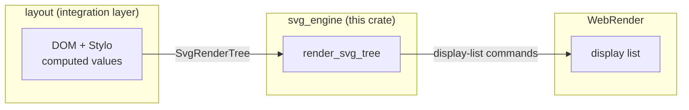
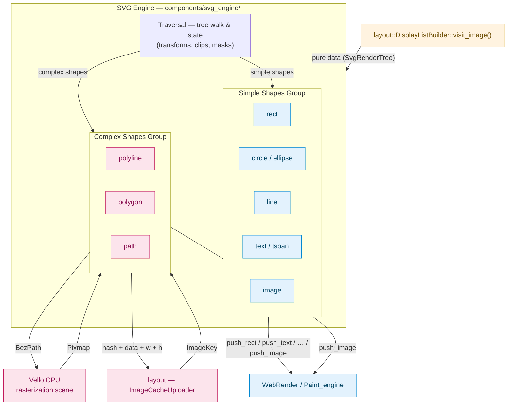
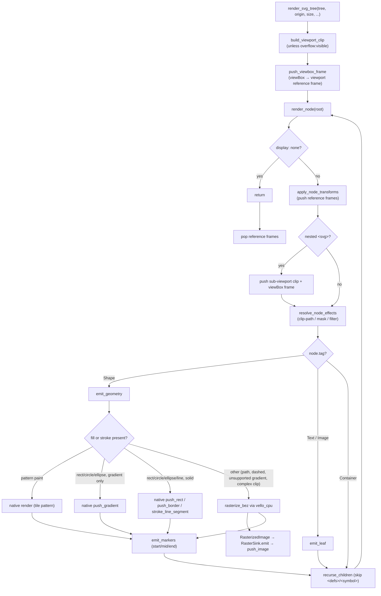

# `svg_engine` — Software SVG Render Engine

## General description (one sentence)

Servo's SVG rendering pipeline: converts `<svg>` embedded in HTML into
WebRender display-list commands.

## General description of the design

Rendering SVG in Servo is split into two stages with a single, well-defined
boundary: the document is converted into a data structure first, and that data
structure is then turned into drawing commands. The first stage lives in
`layout`; the second is this crate.

**1. Integration layer — `DOM` → `SvgRenderTree` (in `layout`)**

The `layout` crate owns the boundary between the document and the renderer. Its
`build_svg_render_tree` entry point walks the SVG subtree, resolves CSS
computed values, and collects the `<defs>` resources (gradients, patterns,
clip-paths, masks, filters, and markers) into a pure-data `SvgRenderTree`. The
result is a tree of `SvgRenderNode`s carrying only the geometry and paint
information the renderer needs — no DOM or layout types leak through.

**2. The engine — `SvgRenderTree` → display commands (in `svg_engine`)**

This crate's core is `render_svg_tree`, which walks the `SvgRenderTree`
recursively and emits a WebRender display list. At each node it resolves the
inherited transforms, clips, and paint, then produces the matching primitive.
Shapes are emitted through one of two paths: a native path that pushes
WebRender items directly (`push_rect`, `push_border`, `push_gradient`,
`push_text`, `push_image`) for shapes WebRender can express natively, and a
software path that rasterizes the shape with `vello_cpu` into a
`RasterizedImage` and pushes it as a single image. The split exists because
WebRender cannot natively express arbitrary paths and certain border and
gradient cases, so those fall back to CPU rasterization.

## Input, process, output

At the top level the engine takes an `SvgRenderTree` (built from the DOM by
`layout::svg::build_svg_render_tree`), walks it recursively, and emits WebRender
display-list commands — native primitives (`push_rect`, `push_border`,
`push_gradient`, `push_text`, `push_image`) for shapes WebRender can express
directly, or a `push_image` of a `RasterizedImage` rasterized by `vello_cpu`
(`RasterSink::emit`) for everything else. The table below breaks that down per
SVG element.

| Input | Processing | Output |
|-------|------------|--------|
| `<rect>` | Fill / stroke / gradient painted into its bounds; `rx`/`ry` corner radii become a rounded-rect clip chain | `push_rect` / `push_border` / `push_gradient` |
| `<circle>` | Delegates to `<rect>`: converted to a rect with `rx = ry = r` | `push_rect` / `push_border` / `push_gradient` |
| `<ellipse>` | Delegates to `<rect>`: converted to a rect with `rx`/`ry` radii | `push_rect` / `push_border` / `push_gradient` |
| `<line>` | Solid/gradient stroke drawn as a rotated rect | `push_rect` |
| `<path>` | Converted to a `BezPath`, then `vello_cpu` rasterizes it into an RGBA pixmap | `RasterizedImage` → `push_image` |
| `<polyline>` | Converted to an open `BezPath`, then `vello_cpu` rasterizes it into an RGBA pixmap | `RasterizedImage` → `push_image` |
| `<polygon>` | Converted to a closed `BezPath`, then `vello_cpu` rasterizes it into an RGBA pixmap | `RasterizedImage` → `push_image` |
| `<image>` | `href` resolved to an `ImageKey` at build time; `preserveAspectRatio` fits the natural size into the viewport, then drawn with `push_image` (gray placeholder if not loaded) | `push_image` |
| `<text>` | Applies `text-anchor`/RTL alignment and fill/stroke, then emits glyphs grouped by font | `push_text` |
| `<tspan>` | Applies fill/stroke and emits its glyphs inline within the `<text>` line | `push_text` |

## Scope

`svg_engine` renders embedded `<svg>` content directly into the WebRender
display list — geometric shapes, paint (fills, strokes, gradients, patterns),
text, images, and a subset of effects — all resolved through the same CSS
cascade as the rest of the page. Its scope, and the constraints it operates
under:

**Features added**

- **Shapes** — `<rect>`, `<circle>`, `<ellipse>`, `<line>`, `<polyline>`,
  `<polygon>`, and `<path>` (see `src/shapes/`).
- **Paint** — solid fills/strokes, `<linearGradient>`/`<radialGradient>`
  (objectBoundingBox and userSpaceOnUse units, `gradientTransform`,
  `spreadMethod`, `stop-color`/`stop-opacity`), and `<pattern>` tiling.
- **Text & image** — `<text>`/`<tspan>` with per-glyph shaping, `text-anchor`,
  `dominant-baseline`, `dx`/`dy`/`rotate`, RTL; `<image>` with
  `preserveAspectRatio`.
- **Effects** — `clip-path` (rect, rounded-rect, and polygon/path), `<mask>`, and a subset
  of `<filter>` primitives (`feGaussianBlur`, `feDropShadow`, `feColorMatrix`,
  `feComponentTransfer`-style saturate, `feFlood`, `feOffset`).
- **Transforms & viewports** — `transform` attributes (translate/scale/rotate/
  skew/matrix), `vector-effect: non-scaling-stroke`, nested `<svg>`, `viewBox`
  + `preserveAspectRatio`, `overflow: visible`.
- **Markers** — `marker-start`/`marker-mid`/`marker-end` with `markerUnits`,
  `orient`, and marker `viewBox`.

**Constraints**

- **Software rendering only** — there is no GPU scene; shapes are either native
  WebRender items or CPU-rasterized via `vello_cpu`.
- **No full SVG filter graph** — `feComposite`, `feTile`, and `feImage` are
  recognized but pushed as `FilterOp::Identity` placeholders; multi-input
  filter chains are not supported.
- **Transforms inside clip definitions are ignored** — a `clipPath`/`<mask>`
  shape nested in a transformed `<g>` clips with the shape but not the inner
  transform, since clip-shape geometry doesn't carry its own transform.
- **Radial gradients with an offset focal point (`fx`/`fy`) or focal radius
  (`fr`)** and `linearRGB` interpolation fall back to software rendering.
- **`<defs>`/`<symbol>` children render only when referenced** via `<use>`;
  they are skipped during normal traversal.

**New relative to the old pipeline**

The previous implementation serialized the `<svg>` subtree to a string and
rasterized it into a single cached `VectorImage` bitmap. Rendering through the
display list instead adds features that approach could not provide:

- **CSS cascade and external styles** — styles are resolved through Stylo's
  `ComputedValues`, so external stylesheets, inheritance, `!important`, and the
  full cascade apply to SVG exactly as they do to HTML. The old pipeline only
  preserved inline presentation attributes, because the serialized string
  carried no computed style.
- **Incremental updates — possible, not yet implemented.** The engine is
  currently stateless: `render_svg_tree` re-emits the full display list and
  re-rasterizes complex paths on every paint, with no SVG-specific invalidation
  or raster cache. Because the input is a structured `SvgRenderTree` rather
  than one opaque bitmap, per-shape raster caching and subtree invalidation can
  be added later; the old pipeline could only ever re-rasterize the entire
  image.
- **Animation — not implemented (SMIL).** There are no `<animate>` /
  `<animateTransform>` elements and no live `SVGAnimated*` attributes (the IDL
  is stubbed out). Animatable CSS properties change through Servo's normal
  style pipeline upstream of this crate; SVG-native SMIL animation is out of
  scope for now.

## Implementation design

### System boundaries

`svg_engine` exposes a single interface — `render_svg_tree` — which takes an
`SvgRenderTree` and emits a WebRender display list.

### Module map

| Module | Responsibility |
|--------|----------------|
| [`render_tree`](src/render_tree.rs) | `SvgRenderTree`/`SvgRenderNode`, `SvgTag`, definition types, `viewBox`/`preserveAspectRatio` parsing |
| [`shapes`](src/shapes/mod.rs) | `Shape` enum + the 7 geometric shape structs; `to_bez_path`, `clip_info` |
| [`style`](src/style/mod.rs) | `NodeStyle`, fill/stroke params, gradient types, hints, transforms, visibility |
| [`text`](src/text.rs) / [`image`](src/image.rs) | `TextSpan`/`ShapedGlyph` and `SvgImage` leaf types |
| [`traversal`](src/traversal.rs) | `render_svg_tree` + recursive `render_node`; transform/effect resolution |
| [`renderer`](src/renderer/mod.rs) | `Render` trait, `RenderContext`, per-shape impls, gradient/pattern pipelines |
| [`tessellator`](src/tessellator.rs) | lyon polygon triangulation + scanline fill |
| [`effects`](src/effects/mod.rs) | clip-path/mask chain building (`clip`) and filter-op resolution (`filter`) |
| [`visitor`](src/visitor.rs) | post-construction tree mutations (e.g. `PaintServerFixupVisitor`) |
| [`error`](src/error.rs) | `SvgEngineError` / `SvgResult` |

### Architecture

One traversal fans out into two rendering paths: simple shapes are pushed to
WebRender natively, and complex shapes are rasterized through `vello_cpu` and
uploaded as images.

### Render pipeline flow

### Key design decisions

- **`Render` trait dispatch** ([render_trait.rs](src/renderer/render_trait.rs)) —
  every shape implements `Render`, so traversal calls `shape.render(ctx)` with no
  central match. `RenderContext` bundles `DisplayListBuilder`, spatial/clip ids,
  scale factors, and the `RasterSink`.
- **Two rendering paths** ([traversal.rs](src/traversal.rs), `emit_shape`) — a
  shape is pushed natively when its full paint (fill **and** stroke) can be
  expressed natively: solid rect/circle/ellipse/line (`push_rect`/`push_border`/
  `stroke_line_segment`) and gradient rect/circle/ellipse (`push_gradient`).
  Everything else — paths, polygons, polylines, dashed rect/circle/ellipse
  borders, unsupported gradients, and polygon/path clips — goes through
  `vello_cpu` into a `RasterizedImage`, which is uploaded and pushed inline in
  document order so z-order stays correct against native primitives. (Pattern
  content and the software gradient fallback use a third, in-between mechanism —
  the `tessellator` — which emits `push_rect` scanline bands rather than a
  raster image.)
- **`RasterSink` + `RasterImageUploader`** ([lib.rs](src/lib.rs)) — the crate
  never depends on `net_traits`; layout adapts its image cache to the
  `RasterImageUploader` trait, and `RasterSink` pushes each raster as an image
  item carrying the outer SVG element's spatial id, clip chain, and flags.
- **Resource providers** ([providers.rs](src/renderer/providers.rs)) —
  `PaintResourceProvider`, `ClipMaskProvider`, `FilterProvider`, and
  `MarkerProvider` abstract where `<defs>` resources live (normally the
  `SvgRenderTree` itself), keeping the traversal decoupled from the tree layout.
- **Effects are resolved before painting** — clip-path and mask shapes become
  WebRender clip chains (mask shapes render the element once per chain for
  union/OR semantics); filters become a `Vec<FilterOp>` pushed as a stacking
  context.

## Third-party dependencies and build-system impact

Dependencies declared in [Cargo.toml](Cargo.toml):

| Library | Usage |
|---------|-------|
| `euclid` | Affine transforms (`Transform2D`) for node/viewBox/gradient/pattern/marker matrices, plus the `Point2D`/`Rect`/`Size`/`Vector2D` primitives behind layout coordinates |
| `kurbo` | Path representation: `BezPath` (every shape via `to_bez_path`), `Stroke` + dash handling, `Affine`, and `PathEl` — the format handed to `vello_cpu` and the basis of clip-path/mask `ComplexClip` geometry |
| `lyon` | Polygon tessellation: `FillTessellator` triangulates polygons into triangles emitted as per-scanline `push_rect` bands, used to fill shapes inside `<pattern>` content |
| `svgtypes` | Spec-compliant SVG parsing: `Length`/`LengthUnit`, `PointsParser`, `ViewBox`, `Color`, and `TransformListParser` — backing `attr_parsers`, `render_tree`, `transform_ops` |
| `vello_cpu` | Software rasterization — takes a `BezPath` and produces an RGBA `Pixmap` |

`euclid`, `kurbo`, and `vello_cpu` are already dependencies of existing Servo
components (the canvas and layout crates); the engine introduces only two new
third-party crates — `lyon` (polygon tessellation) and `svgtypes` (SVG value
parsing).

**Build-system impact**

- `svg_engine` is a **workspace member** (root `Cargo.toml` line 5), published
  as `svg_engine = { version = "=0.6.0", path = "components/svg_engine" }`.
- No build bootstrap, feature-unification, or build-script changes are
  introduced — the added crates are pure Rust libraries.
- `vello_cpu` is enabled with the `multithreading` feature in the workspace pin.

## New public API

The crate's public surface (re-exported from [`lib.rs`](src/lib.rs)).

### Entry point

| API | Description | Parameters | Returns |
|-----|-------------|------------|---------|
| `render_svg_tree` | Renders an entire `SvgRenderTree` into a WebRender display list. | `tree: &SvgRenderTree`, `svg_origin: &LayoutPoint`, `svg_size: LayoutSize`, `device_scale: f32`, `spatial_id: SpatialId`, `clip_chain_id: ClipChainId`, `sink: &RasterSink`, `wr: &mut DisplayListBuilder` | `()` |

### Core data types

| API | Description | Key fields / variants |
|-----|-------------|----------------------|
| `SvgRenderTree` | Root of the render tree plus viewport info and all `<defs>` resource maps. | `root: SvgRenderNode`, `viewport: ViewportInfo`, `gradients`, `clip_paths`, `patterns`, `masks`, `filters`, `markers` (all `HashMap<String, …>`) |
| `SvgRenderNode` | One tree node. | `id: Option<String>`, `tag: SvgTag`, `style: NodeStyle`, `transforms: Vec<TransformOp>`, `viewport: Option<SvgViewport>`, `children: Vec<SvgRenderNode>` |
| `SvgTag` | Discriminates node content. | `Shape(Shape)`, `Text(TextSpan)`, `Image(SvgImage)`, `Container(Container)` |
| `Shape` | Geometric shape enum. | `Rect`, `Circle`, `Ellipse`, `Line`, `Polyline`, `Polygon`, `Path` |
| `Container` | Container kind. | `Group`, `Svg`, `Defs`, `Use`, `Symbol`, `Text` |
| `NodeStyle` | Paint-level styling. | `visibility`, `display`, `fill: Option<FillParams>`, `stroke: Option<StrokeParams>`, `render_hints`, `effects`, `opacity`, `markers` |
| `GradientKind` | Resolved native WebRender gradient. | `Linear { start, end, stops, extend_mode }` \| `Radial { center, radius, stops, extend_mode }` |
| `RasterizedImage` | CPU-rasterized RGBA image ready to upload. | `x`, `y`, `width`, `height`, `scale`, `data: Vec<u8>`, `content_hash: u64` |

### Upload / sink traits

| API | Description | Parameters | Returns |
|-----|-------------|------------|---------|
| `RasterImageUploader::upload` | Uploads RGBA pixels into the WebRender image cache (implemented by layout's image cache). | `hash: u64`, `data: Vec<u8>`, `width: u32`, `height: u32` | `Option<ImageKey>` |
| `RasterSink` | Inline raster sink holding the outer SVG element's spatial/clip context. | (struct fields: `uploader`, `spatial_id`, `clip_chain_id`, `clip_rect`, `flags`, `origin`) | — |

### Text and image

| API | Description |
|-----|-------------|
| `TextSpan` | A text run with `text`, `x`/`y`, `dx`/`dy`/`rotate`, shaped `glyphs`, `text_anchor`, `rtl`, `dominant_baseline`, `font_instance_key`, `advance_offset`, `font_size`. |
| `ShapedGlyph` | Pre-shaped glyph: `x`, `y`, `advance`, `glyph_id: u32`, `character`, `font_instance_key`. |
| `TextAnchor` | `Start` \| `Middle` \| `End` (with `alignment_offset() -> f32`). |
| `DominantBaseline` | `Auto` \| `Hanging` \| `Middle` \| `Central`. |
| `SvgImage` | `<image>` leaf: `x`, `y`, `width`, `height`, `href`, `image_key`, `natural_width/height`, `preserve_aspect_ratio`. |

### Errors, parsing, and visitors

| API | Description | Parameters | Returns |
|-----|-------------|------------|---------|
| `SvgEngineError` | SVG parse/extraction error. | (variants) `MissingAttribute(String)`, `ParseError(String)`, `UnsupportedFeature(String)` | — |
| `SvgResult<T>` | Result alias. | — | `Result<T, SvgEngineError>` |
| `parse_aspect_ratio` | Parses a `preserveAspectRatio` string. | `value: &str` | `AspectRatio` |
| `extract_viewbox` | Parses a `viewBox` string via `svgtypes`. | `value: &str` | `Option<ViewBox>` |
| `PaintServer::from_attr` | Parses a paint value (`"red"`, `"#fff"`, `"url(#id)"`). | `val: &str` | `Option<PaintServer>` |
| `parse_gradient_element` | Parses `<linearGradient>`/`<radialGradient>` attributes + stops. | `element_name: &str`, `get_attr: &dyn Fn(&str) -> Option<String>`, `stop_attrs: &[Vec<(String, String)>]` | `SvgResult<GradientDef>` |
| `color_at_t_with_space` | Evaluates a gradient stop list at parametric position `t`. | `stops: &[GradientStop]`, `t: f32`, `space: ColorInterpolation` | `ColorF` |
| `SvgRenderTreeVisitor::visit_node` | Read-only pre-order visitor. | `node: &SvgRenderNode` | `VisitDecision` |
| `SvgRenderTreeVisitorMut::visit_node_mut` | Mutable pre-order visitor. | `node: &mut SvgRenderNode` | `VisitDecision` |
| `VisitDecision` | Traversal control. | (variants) `Continue`, `SkipChildren`, `Stop` | — |
