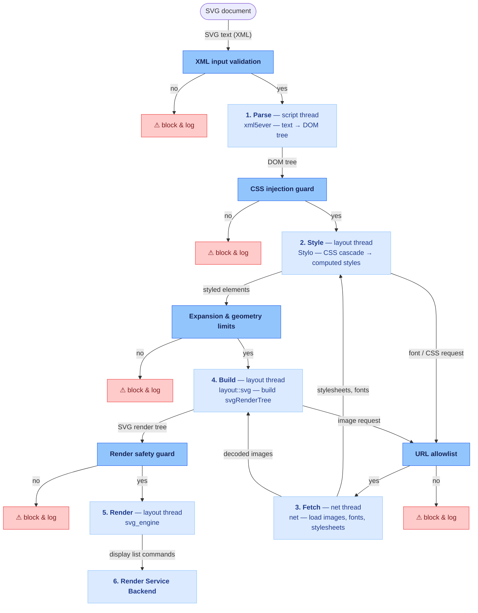

## SVG rendering pipeline & security layers

- **XML input validation** (Stage 1 — Parse) — blocks XXE and entity-expansion
bombs, and limits nesting depth and element count during tokenization.
- **CSS injection guard** (Stage 2 — Style) — blocks injected SVG `<style>`
from reading host-document data via attribute selectors + `url()` .
- **URL allowlist** (Stage 3 — Fetch) — rejects untrusted schemes/origins
(SSRF via `<image>`/`@import`/`@font-face`, `file://`, tracking) before any
request leaves the process; audits the image-decode FFI.
- **Expansion & geometry limits** (Stage 4 — Build) — limits `<use>` fan-out
and extreme `viewBox`, blur, path, and stroke values before the render tree
is built.
- **Render safety guard** (Stage 5 — Render) — validates geometry and text and
limits self-referencing patterns before drawing, so crafted input can't
crash the renderer or execute code.

---