# SVG Engine — Data Model

Class diagrams for the `svg_engine` crate's **model** half (`src/model/`): the pure
SVG data model that the layout layer builds and the render layer consumes.

The model is deliberately free of any rendering dependency — it does **not** import
`webrender_api`, `euclid`, `kurbo`, `lyon`, `log`, or `vello_cpu`. Its only external
crate is [`svgtypes`](https://crates.io/crates/svgtypes), used solely for the `Color`
type (shown as `Color` below).

### How to read these diagrams

| Notation | Meaning |
|----------|---------|
| plain box | Rust `struct` (fields listed) |
| `<<enum>>` | Rust `enum` (variants listed) |
| `<<interface>>` | Rust `trait` |
| `A *-- B` | `A` owns `B` (composition) |
| `A o-- B` | `A` holds an optional / `Arc` reference to `B` |
| `A ..> B` | `A` uses `B` (method parameter / visitor) |
| `A <|-- B` | `B` implements `A` |

Where one concept spans several independent clusters of types, they are drawn as
separate stacked diagrams — one per connected component — so each diagram reads as a
single self-contained picture.

---

## 1. Module map

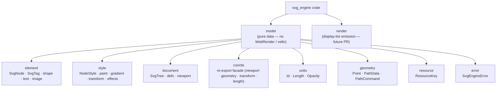

The model splits into three conceptual buckets — **element** (anything written as
`<element>`), **style** (anything that can be an attribute), **document** (the tree,
viewport, and `<defs>` definitions) — plus four leaf modules (`units`, `geometry`,
`resource`, `error`) of small shared value types, and `coords`, a chapter-facing facade
that re-exports the coordinate-system types (`ViewportInfo`, `SvgViewport`, `ViewBox`,
`AspectRatio`, `Point`, `PathData`, `PathCommand`, `TransformOp`, `Length`) from their
canonical homes.

---

## 2. Render tree

The render tree is a **plain owned tree**: `SvgTree → SvgNode → children` with no
`Arc`/`Rc` indirection. Definitions referenced by id live in flat maps on `SvgTree`
(see §6); nodes refer to them via `DefRef` / `PaintServer` handles, not pointers.

### Tree structure

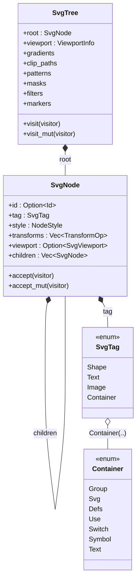

- Each `SvgNode` carries three kinds of data: **what it is** (`tag`), **how it's
  painted** (`style: NodeStyle`), and **how it's transformed** (`transforms`, structural
  not paint-level). A nested `<svg>` viewport hangs off `viewport`.
- The six def maps on `SvgTree` are `HashMap<String, Arc<T>>` keyed by element `id`
  (no `#` prefix): `gradients → Arc<GradientDef>`, `clip_paths → Arc<ClipPathDef>`,
  `patterns → Arc<PatternDef>`, `masks → Arc<MaskDef>`, `filters → Arc<FilterDef>`,
  `markers → Arc<MarkerDef>`.

### Visitor

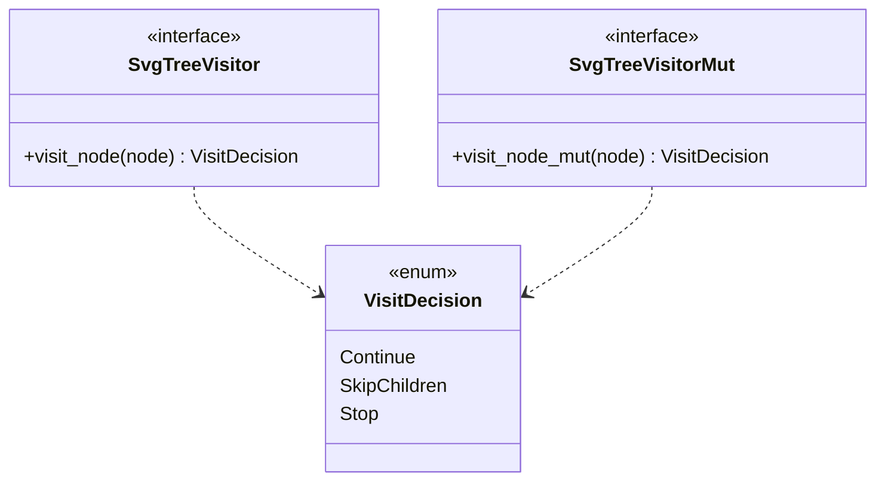

- Traversal is a classic visitor: `SvgTree::visit` / `visit_mut` delegate to
  `SvgNode::accept` / `accept_mut` (tree diagram above), which drive
  `Continue` / `SkipChildren` / `Stop`.

---

## 3. Elements — shape, text, image

### Shapes

Shapes live in `element::shape` — re-exported flat as `element::Shape`,
`element::Rectangle`, … — so every `<element>` type is reachable from
`svg_engine::element` (see §1).

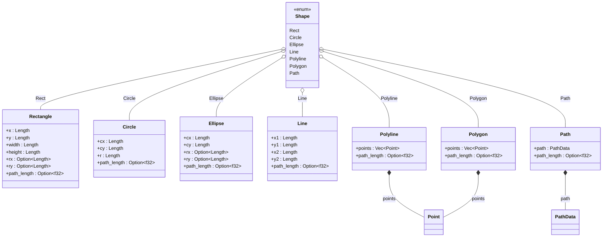

- Shapes hold **already-resolved geometry** (`Length`/`Point`/`PathData`) — the layout
  layer does the `d`-attribute parsing and `rx`/`ry` resolution; the model stores the
  result. `Path::path` is a flat `Vec<PathCommand>` (absolute coordinates only).
- Every shape (and `<path>`) carries `path_length: Option<f32>` — the author-asserted
  `pathLength` attribute, used to calibrate distance-along-path math (notably stroke
  dashing). `Shape::path_length()` reads it uniformly.
- `Ellipse`'s `rx`/`ry` are `Option<Length>` just like `Rectangle`'s: SVG 2 makes the
  radii support `auto`, resolved by `resolved_radii()` (both `auto` → no rendering; one
  `auto` → derive from the other, yielding a circle).

### Text

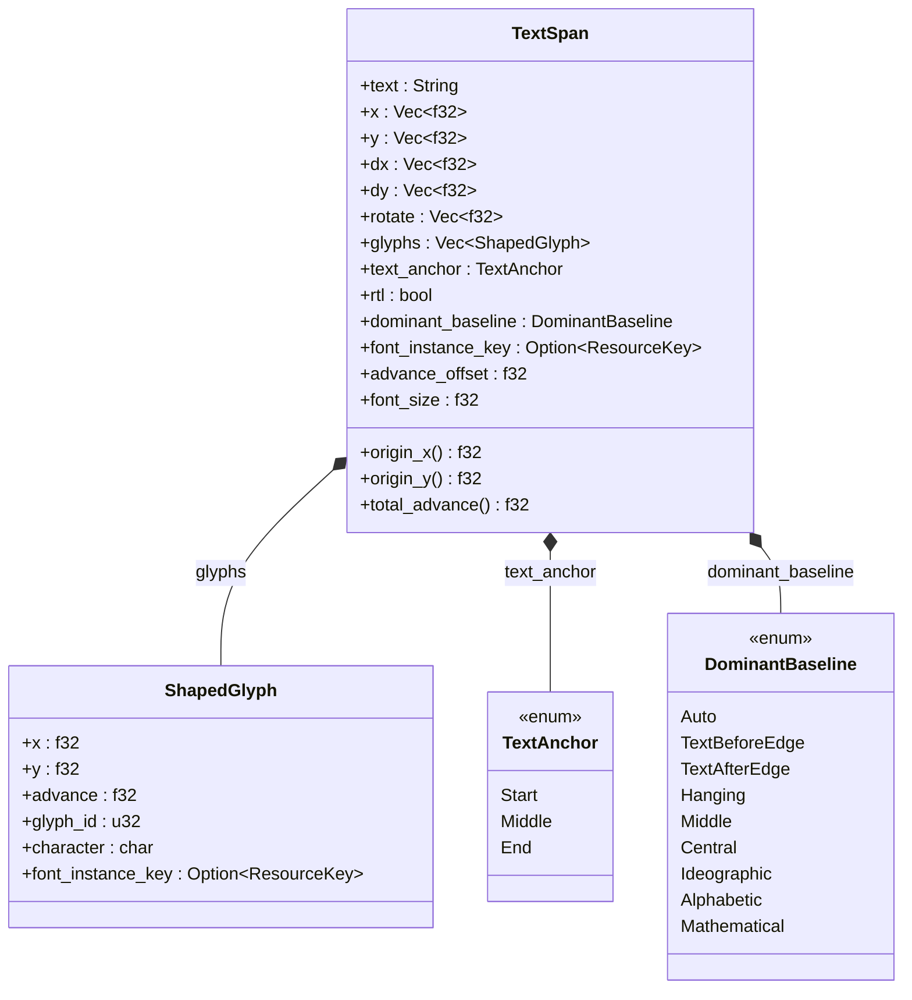

- `TextSpan` carries both raw text *and* pre-shaped `ShapedGlyph`s (per-glyph font key,
  so mixed-script runs work). `Text` is also a `Container` variant in §2 (inline runs).
- `x`/`y` are per-character **coordinate lists** (SVG §11.5.2): each entry repositions the
  current text position for the matching character. `origin_x()`/`origin_y()` return `x[0]`
  /`y[0]` (or `0` when unset) and the renderer offsets shaped glyphs by that origin.
  `dx`/`dy`/`rotate` are likewise per-character lists.

### Image

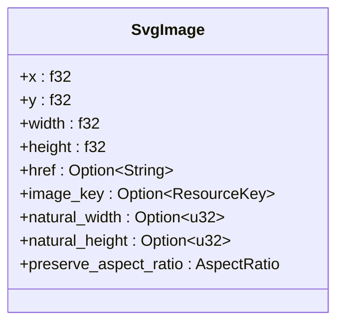

- `SvgImage` keeps the raster handle (`image_key: ResourceKey`) opaque, so the model
  never touches `webrender_api::ImageKey`; the render layer reconstructs the key.

---

## 4. Style — paint, effects, hints, transforms

### Node style & painting

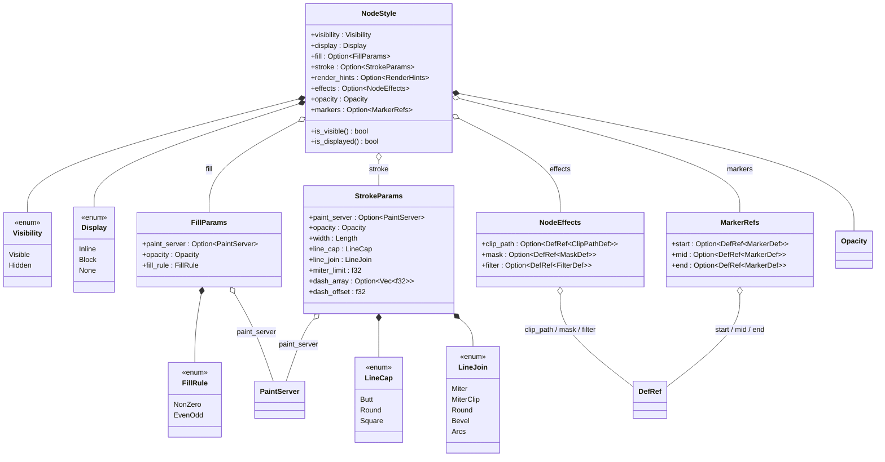

- `NodeStyle` is **paint-level only**; layout-affecting state (transforms, viewport) lives
  on `SvgNode`, not here. Its `render_hints` field is detailed in the next diagram.
- `fill` / `stroke` are `Option` — SVG's "no fill / no stroke" is distinct from a default
  black fill, and the renderer checks `is_some()`.
- There is **no `color` field** on `FillParams`/`StrokeParams`: a solid color lives inside
  the `PaintServer::Solid(Color)` variant (see §5), reached via `paint_server`.
- Effects (`clip_path`, `mask`, `filter`) and markers are `DefRef<T>` — a `#id` during
  build, rewritten to an `Arc<T>` handle by the resolve pass (see §6). The same
  transient-then-resolved pattern appears as `PaintServer::Ref` in §5.

### Render hints & paint order

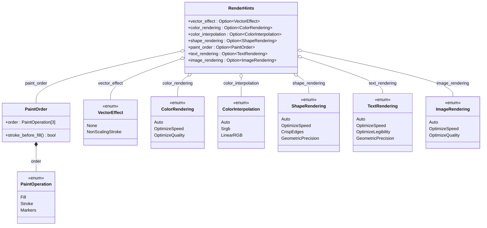

- `PaintOrder` is a **struct**, not an enum — it wraps an ordered `[PaintOperation; 3]`
  triple (default `[Fill, Stroke, Markers]`), and `stroke_before_fill()` answers the
  "does the stroke draw under the fill?" question the renderer needs.
- `RenderHints` folds the rendering-quality/order hints; several are spec stubs gated
  `#[allow(dead_code)]` (`text_rendering`, `image_rendering`).

### Transform

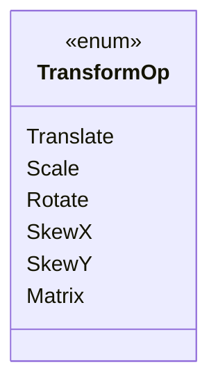

- `TransformOp` is an ordered list (`Vec<TransformOp>`) on `SvgNode` — `matrix(a b c d e f)`
  is a variant, not a wrapper.

---

## 5. Paint servers & gradients

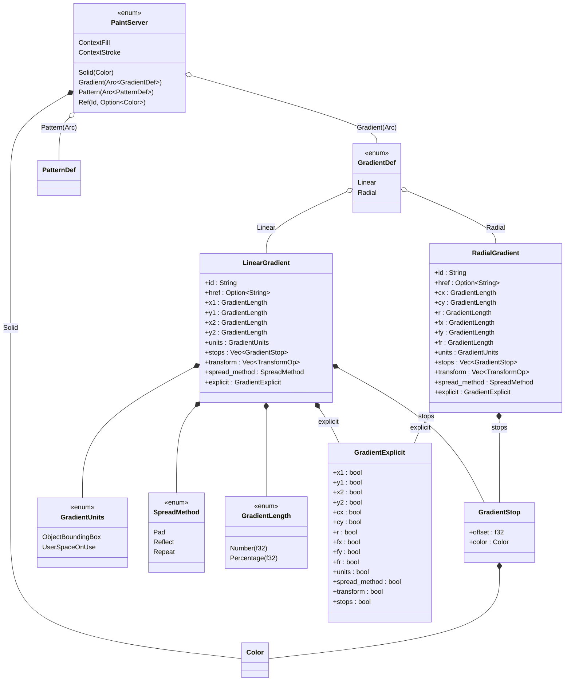

- `PaintServer` mirrors `DefRef`: `Solid`/`Gradient`/`Pattern` are resolved forms, `Ref`
  (a struct variant with named `id`/`fallback` fields, drawn tuple-style above) is the
  transient build-time state that the resolve pass rewrites to an `Arc` handle.
  No `Ref` value survives past build. `ContextFill`/`ContextStroke` carry the
  `context-fill`/`context-stroke` keywords through `<marker>`/`<use>` (they render as no
  paint when no context element supplies the value).
- `GradientDef` stores parsed `<linearGradient>` / `<radialGradient>` from `<defs>`;
  `href` inheritance is supported — `GradientExplicit` records which attributes were
  *authored* (vs. defaulted) so an inherited value can be told apart from a local default
  (matters for `fx`/`fy`).
- `Color` = `svgtypes::Color`.

---

## 6. Definitions & references (`<defs>`)

### `DefRef`

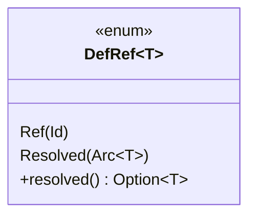

- `DefRef<T>` is the core indirection: `Ref(Id)` during tree building → `Resolved(Arc<T>)`
  after the resolve pass. `Clone` is manual so `DefRef<T>` is `Clone` for any `T`, even
  `ClipPathDef`/`MaskDef`/`FilterDef`/`MarkerDef` that embed a non-`Clone` `SvgNode`.

### Clip, mask, pattern, marker

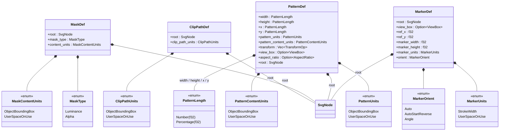

- Every definition type stores its **content as a nested `SvgNode` subtree** (`root`), so
  `<g>`, `<use>`, `<text>`, and nested `<defs>` inside a clip/mask/pattern/marker are not
  flattened away — they stay a full sub-tree.
- `PatternDef`'s `x`/`y`/`width`/`height` are `PatternLength` — a `Number`/`Percentage`
  newtype (like `GradientLength`) that keeps the unit until the reference box is known at
  render time.

### Filter

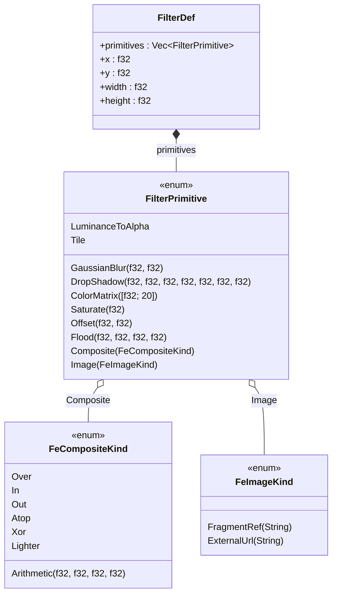

- `FilterPrimitive` carries typed payloads: `Composite(FeCompositeKind)` (arithmetic or a
  Porter-Duff operator) and `Image(FeImageKind)` (a `#fragment` or external URL). The
  `Arithmetic` composite is a struct variant with named `k1`–`k4` coefficients
  (drawn tuple-style above: `result = k1·i1·i2 + k2·i1 + k3·i2 + k4`).

---

## 7. Viewport

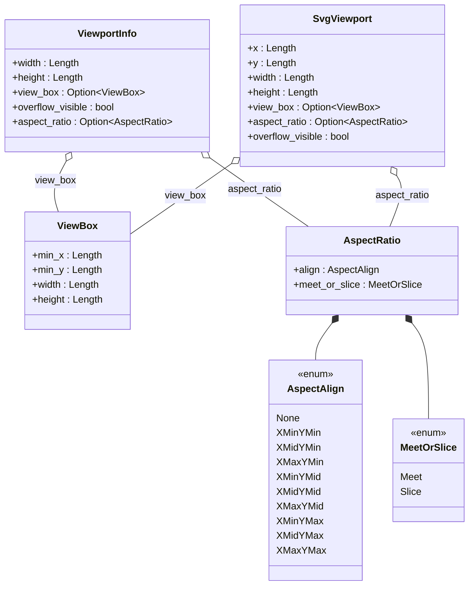

- `ViewportInfo` is the **root** `<svg>` viewport (its size is imposed by layout), stored on
  `SvgTree::viewport`. `SvgViewport` is a **nested** `<svg>` viewport, carried by
  `SvgNode::viewport` — it owns its `x`/`y`/`width`/`height` in the parent coordinate system.
- `AspectRatio` defaults to `xMidYMid meet` (SVG spec: `viewBox` alone implies it).

---

## 8. Leaf value types

### Geometry

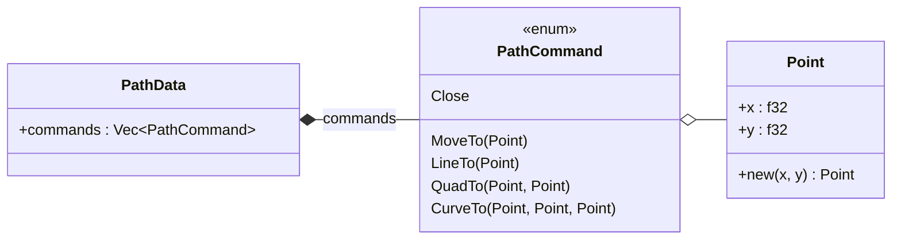

- **`PathData`** is a flat absolute-coordinate command list (no relative commands, no
  arcs) — the layout layer normalizes the SVG `d` attribute into this form.

### Typed newtypes

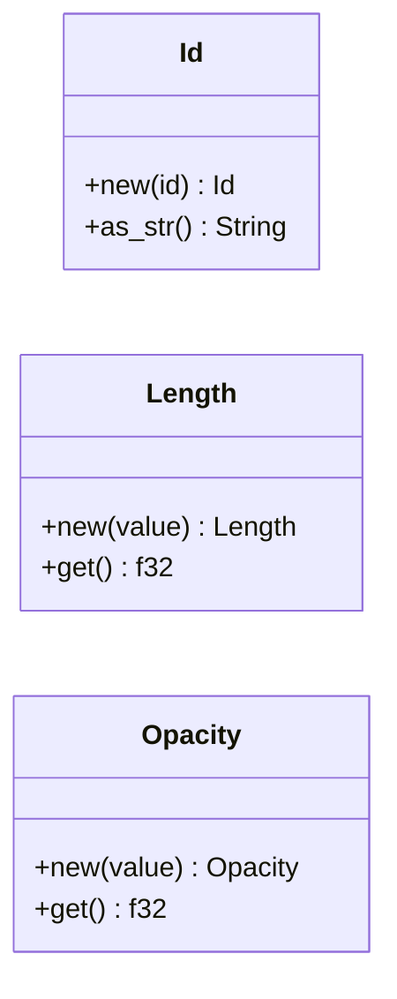

- **Typed newtypes** (`Id`, `Length`, `Opacity`) turn unit mix-ups into compile-time
  errors: an opacity can't be passed where a length is expected. `Length` is
  **unit-erased** — by the time it's built, `px`/`em`/`%`/… are already resolved to user
  space, so the renderer cannot recover the original unit. `Opacity` clamps to `[0, 1]`;
  `Length` may be negative.

### Resource & error

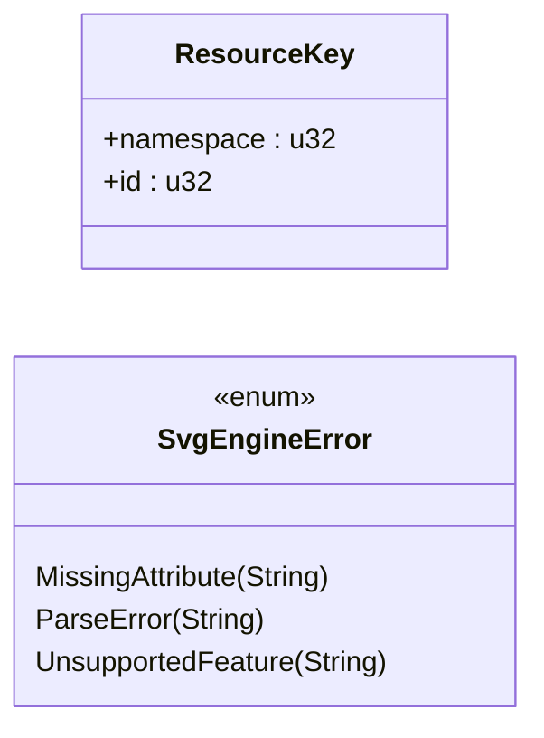

- **`ResourceKey`** is an opaque `(namespace, id)` pair that round-trips to
  `webrender_api::{ImageKey, FontInstanceKey}` — the model carries no WebRender type.
