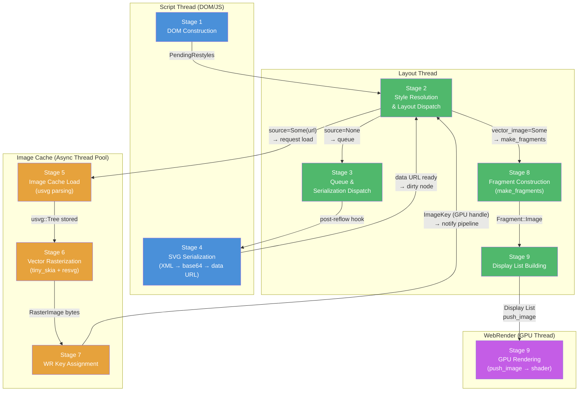
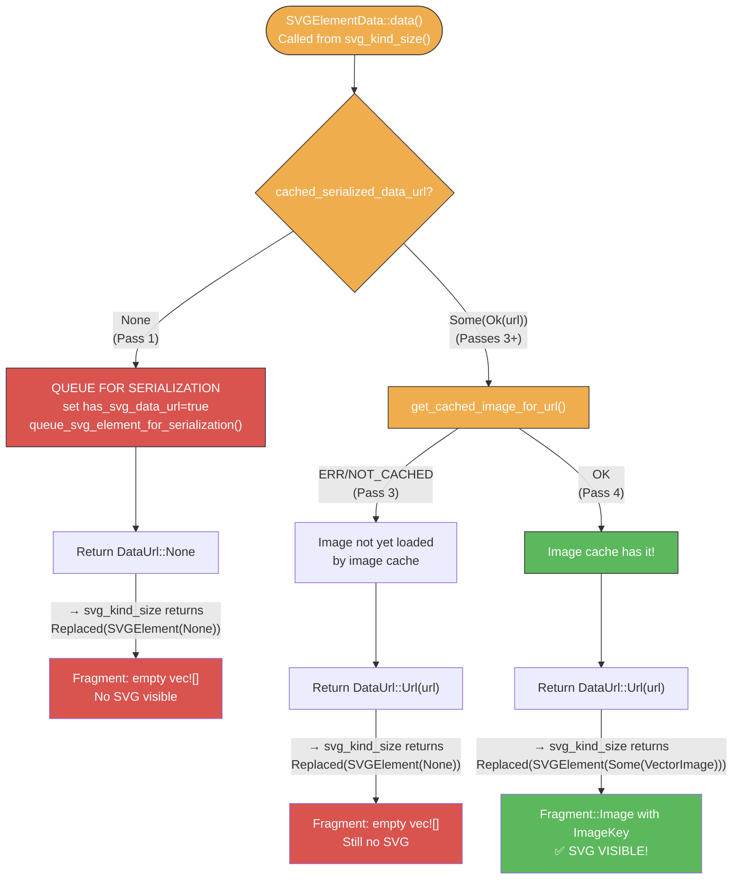
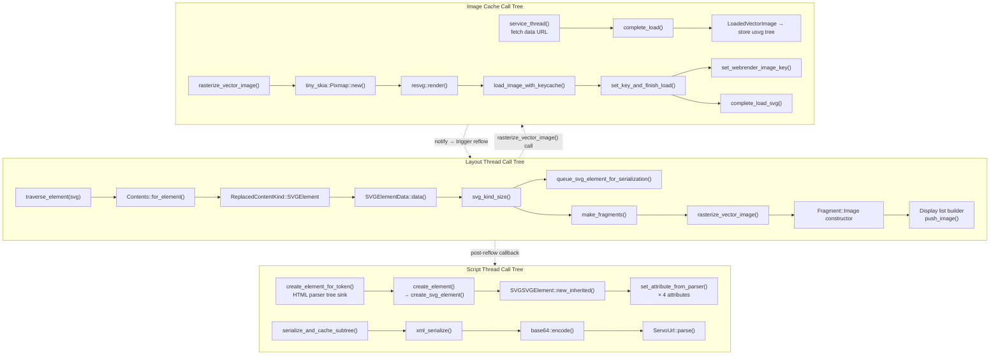

# SVG Rendering Pipeline — Visual Diagrams

> Open this file in VS Code and use **Ctrl+K V** (or right-click → **Open Preview**) to render the Mermaid diagrams.
> Also renders natively on GitHub.

---

## 1. Thread Architecture Overview

Shows the 4 execution threads and which stages run on each. Arrows indicate how data and control flow between threads.



---

## 2. The Four-Pass Reflow Sequence

A chronological sequence diagram showing how the 4 passes unfold over time across threads. This is the most important diagram for understanding why SVG takes 4 passes to appear.

```mermaid
sequenceDiagram
    participant HTML as HTML Parser
    participant Script as Script Thread
    participant Layout as Layout Thread
    participant IC as Image Cache
    participant WR as WebRender GPU

    Note over HTML,WR: ═══════ PASS 1 ═══════ (DOMChanged | PendingRestyles)
    HTML->>Script: create_svg_element() → SVGSVGElement<br/>uuid=90b40da2..., cached=None
    HTML->>Script: set attributes: width=200, height=200, viewBox=...
    Script->>Layout: trigger reflow (DOMChanged)
    Layout->>Layout: traverse_element(svg) → display=Inline
    Layout->>Layout: Contents::for_element() → Replaced(SVGElement)
    Layout->>Layout: SVGElementData::data() → source=None
    Layout->>Layout: svg_kind_size() → source=None → QUEUE
    Layout->>Layout: queue_svg_element_for_serialization()
    Layout->>Layout: make_fragments() → vec![] (empty)
    Layout->>Script: post-reflow hook
    Script->>Script: handle_pending_images_post_reflow()
    Script->>Script: serialize_and_cache_subtree()
    Note over Script: ◄ triggers Pass 2 via dirty(NodeDamage::Other)

    Note over HTML,WR: ═══════ PASS 2 ═══════ (PendingRestyles)
    Script->>Script: xml_serialize() → 231 bytes XML
    Script->>Script: base64::encode() → 334 chars
    Script->>Script: ServoUrl::parse("data:image/svg+xml;base64,...")
    Script->>Script: cached_serialized_data_url = Some(Ok(url))
    Script->>Script: node.dirty(NodeDamage::Other)
    Script->>Layout: trigger reflow

    Note over HTML,WR: ═══════ PASS 3 ═══════ (PendingRestyles)
    Layout->>Layout: svg_kind_size() → source=Some(Ok(url))
    Layout->>Layout: get_cached_image_for_url() → "ERR/NOT_CACHED"
    Layout->>Layout: vector_image = None
    Layout->>Layout: make_fragments() → vec![] (still empty)
    Layout->>IC: start image load for data URL
    IC->>IC: service_thread() → fetch data URL
    IC->>IC: complete_load(key=1, LoadedVectorImage)
    Note over IC: usvg::Tree parsed,<br/>natural dimensions = 200×200
    IC->>Layout: notify pipeline → trigger reflow

    Note over HTML,WR: ═══════ PASS 4 ═══════ (PendingRestyles)
    Layout->>Layout: svg_kind_size() → source=Some(Ok(url))
    Layout->>Layout: get_cached_image_for_url() → "OK"
    Layout->>Layout: vector_image = Some(VectorImage{id:1, 200×200})
    Layout->>IC: rasterize_vector_image(id=1, 200×200)
    IC->>IC: cache miss → spawn thread pool task
    IC-->>Layout: returns None (async)
    Layout->>Layout: make_fragments() → vec![] (still empty)
    IC->>IC: usvg::Tree → tiny_skia Pixmap(200×200)
    IC->>IC: resvg::render() → 160000 bytes RGBA
    IC->>IC: load_image_with_keycache(Svg)
    IC->>IC: set_key_and_finish_load() → ImageKey(1,90)
    IC->>Layout: notify pipeline → trigger reflow

    Note over HTML,WR: ═══════ PASS 4b ═══════ (same pass, second layout)
    Layout->>Layout: rasterize_vector_image(id=1, 200×200)
    IC-->>Layout: CACHED → RasterImage{id: Some(ImageKey(1,90))}
    Layout->>Layout: Fragment::Image{image_key: Some(ImageKey(1,90))}
    Layout->>Layout: Display List: push_image(ImageKey(1,90), rect=200×200)
    Layout->>WR: send display list
    WR->>WR: GPU renders blue circle at 200×200
    Note over HTML,WR: ✅ SVG VISIBLE ON SCREEN
```

---

## 3. Detailed Pipeline Flowchart

All 9 stages with their key functions, branching decisions, and data transformations.

```mermaid
graph TB
    %% ─── STAGE 1 ───
    subgraph Stage1["Stage 1 — DOM Construction (Script Thread)"]
        direction TB
        A1["HTML Tokenization<br/>html5ever tokenizer"]
        A2["create_element_for_token()<br/>QualName{ns:svg, local:svg}"]
        A3["create_svg_element()"]
        A4{"name.local?"}
        A5["SVGSVGElement::new_inherited()<br/>uuid=random, cached=None"]
        A6["Set attributes:<br/>width=200, height=200,<br/>viewBox=..., xmlns=..."]
        A7["Tree insertion under &lt;body&gt;"]
        
        A1 --> A2
        A2 --> A3
        A3 --> A4
        A4 -->|"svg"| A5
        A4 -->|"circle"| A8["SVGElement::new()"]
        A5 --> A6
        A6 --> A7
    end

    %% ─── STAGE 2 ───
    subgraph Stage2["Stage 2 — Style & Layout Dispatch (Layout Thread)"]
        direction TB
        B1["traverse_element(svg)"]
        B2{"display, is_svg?"}
        B3["Contents::for_element(svg)"]
        B4["ReplacedContentKind::SVGElement"]
        B5["SVGElementData::data()"]
        B6{"source?"}
        B7["svg_kind_size()<br/>→ QUEUE serialization"]
        B8["make_fragments()<br/>vector_image=None<br/>→ vec![]"]
        B9["svg_kind_size()<br/>→ check image cache"]
        B10{"image cached?"}
        
        B1 --> B2
        B2 -->|"Inline + is_svg=true"| B3
        B3 --> B4
        B4 --> B5
        B5 --> B6
        B6 -->|"None"| B7
        B7 --> B8
        B6 -->|"Some(Ok(url))"| B9
        B9 --> B10
        B10 -->|"No (ERR/NOT_CACHED)"| B11["vector_image=None"]
        B10 -->|"Yes (OK)"| B12["vector_image=Some(VectorImage)"]
        B11 --> B8
    end

    %% ─── STAGE 3 ───
    subgraph Stage3["Stage 3 — Queue & Serialization Dispatch (Layout→Script)"]
        direction TB
        C1["queue_svg_element_for_serialization()"]
        C2["PendingImageList stored on LayoutThread"]
        C3["handle_pending_images_post_reflow()"]
        C4["serialize_and_cache_subtree()"]
        
        C1 --> C2
        C2 -->|"post-reflow"| C3
        C3 --> C4
    end

    %% ─── STAGE 4 ───
    subgraph Stage4["Stage 4 — SVG Subtree Serialization (Script Thread)"]
        direction TB
        D1["xml_serialize()<br/>SVGSVGElement → 231 bytes XML"]
        D2["base64::encode()<br/>231 bytes → 334 chars"]
        D3["Build data URL<br/>data:image/svg+xml;base64,..."]
        D4["cached_serialized_data_url = Some(Ok(url))"]
        D5["node.dirty(NodeDamage::Other)"]
        
        D1 --> D2
        D2 --> D3
        D3 --> D4
        D4 --> D5
    end

    %% ─── STAGE 5 ───
    subgraph Stage5["Stage 5 — Image Cache Load (Async Thread Pool)"]
        direction TB
        E1["service_thread()<br/>fetch data URL"]
        E2["complete_load()"]
        E3{"load result type?"}
        E4["Store usvg::Tree<br/>natural dimensions = 200×200"]
        E5["Insert into vector_images map<br/>keyed by PendingImageId(1)"]
        E6["Notify pipeline<br/>(reflow trigger)"]
        
        E1 --> E2
        E2 --> E3
        E3 -->|"LoadedVectorImage"| E4
        E4 --> E5
        E5 --> E6
    end

    %% ─── STAGE 6 ───
    subgraph Stage6["Stage 6 — Vector Rasterization (Async Thread Pool)"]
        direction TB
        F1["rasterize_vector_image(id=1, 200×200)"]
        F2{"cache hit?"}
        F3["Look up usvg::Tree by image_id"]
        F4["Spawn thread pool task"]
        F5["Create tiny_skia Pixmap(200×200)"]
        F6["resvg::render()<br/>→ RGBA pixels"]
        F7["Build RasterImage{<br/>metadata:200×200,<br/>bytes:160000, id:None}"]
        F8["load_image_with_keycache(Svg)"]
        F9["Return Some(RasterImage) immediately"]
        
        F1 --> F2
        F2 -->|"miss"| F3
        F3 --> F4
        F4 --> F5
        F5 --> F6
        F6 --> F7
        F7 --> F8
        F2 -->|"hit"| F9
    end

    %% ─── STAGE 7 ───
    subgraph Stage7["Stage 7 — WR Key Assignment (Image Cache)"]
        direction TB
        G1["set_key_and_finish_load()"]
        G2{"pending variant?"}
        G3["set_webrender_image_key()<br/>→ raster_image.id = Some(ImageKey(1,90))"]
        G4["complete_load_svg()<br/>→ notify pipeline"]
        
        G1 --> G2
        G2 -->|"PendingKey::Svg"| G3
        G3 --> G4
    end

    %% ─── STAGE 8 ───
    subgraph Stage8["Stage 8 — Fragment Construction (Layout Thread)"]
        direction TB
        H1["make_fragments()"]
        H2{"vector_image?"}
        H3["Set base rect from metadata<br/>width=200, height=200"]
        H4["Compute raster_size<br/>scale by device_pixel_ratio"]
        H5["rasterize_vector_image()"]
        H6{"image.id?"}
        H7["Fragment::Image{<br/>image_key: Some(ImageKey(1,90))}"]
        H8["vec![] (empty)"]
        
        H1 --> H2
        H2 -->|"None"| H8
        H2 -->|"Some"| H3
        H3 --> H4
        H4 --> H5
        H5 --> H6
        H6 -->|"None (async)"| H8
        H6 -->|"Some(ImageKey)"| H7
    end

    %% ─── STAGE 9 ───
    subgraph Stage9["Stage 9 — Display List & GPU (Layout → WebRender)"]
        direction TB
        I1["Fragment::Image handler"]
        I2{"visibility?"}
        I3["Translate rect to WR coords"]
        I4["Compute clip rect"]
        I5["builder.wr().push_image()"]
        I6["WebRender batches + renders"]
        I7["Blue circle visible on screen!"]
        
        I1 --> I2
        I2 -->|"Visible"| I3
        I3 --> I4
        I4 --> I5
        I5 --> I6
        I6 --> I7
        I2 -->|"Hidden/Collapse"| I8["Skip (no-op)"]
    end

    %% ─── CROSS-STAGE FLOW ───
    A7 -->|"PendingRestyles → reflow"| B1
    B8 -->|"post-reflow hook"| C1
    D5 -->|"triggers reflow"| B1
    E6 -->|"triggers reflow"| B1
    G4 -->|"triggers reflow"| B1
    B12 --> H2
    H7 --> I1

    %% ─── PASS ANNOTATIONS ───
    PF["Pass 1: DOM → No source → Queue"]
    PS["Pass 2: Serialize → data URL"]
    PT["Pass 3: source=Some(url) → load image"]
    PFR["Pass 4: Image loaded → rasterize → render"]

    style PF fill:#d9e8fc,stroke:#4a90d9
    style PS fill:#d9e8fc,stroke:#4a90d9
    style PT fill:#d9e8fc,stroke:#4a90d9
    style PFR fill:#d9e8fc,stroke:#4a90d9
```



---

## 4. SVGElementData Flow & Decision Tree

This diagram focuses on the critical `SVGElementData::data()` function — the single most important branching point in the pipeline. It is called multiple times across passes and drives the entire SVG rendering flow.



---

## 5. Data Transformations Through the Pipeline

Shows how the SVG data transforms at each stage — from HTML bytes to GPU pixels.

```mermaid
flowchart LR
    subgraph Data["Data Transformations"]
        direction LR
        D1["〈svg width=200...〉<br/>HTML bytes"]
        D2["SVGSVGElement<br/>uuid, cached=None<br/>attributes: 4"]
        D3["XML string<br/>231 bytes"]
        D4["data URL string<br/>334 chars base64"]
        D5["usvg::Tree<br/>parsed SVG tree"]
        D6["Pixmap 200×200<br/>160000 bytes RGBA"]
        D7["RasterImage{<br/>id: ImageKey(1,90)}"]
        D8["Fragment::Image{<br/>image_key: Some(1,90)}"]
        D9["WR DisplayList<br/>PushImage(1,90)"]
        D10["🟦 Blue circle<br/>on screen"]
    end

    D1 -->|"Stage 1<br/>HTML parser"| D2
    D2 -->|"Stage 4<br/>xml_serialize + base64"| D3
    D3 --> D4
    D4 -->|"Stage 5<br/>fetch + usvg parse"| D5
    D5 -->|"Stage 6<br/>resvg::render"| D6
    D6 -->|"Stage 7<br/>bind WR key"| D7
    D7 -->|"Stage 8<br/>make_fragments"| D8
    D8 -->|"Stage 9<br/>push_image"| D9
    D9 -->|"GPU shader"| D10

    style D1 fill:#e8d4f8,stroke:#333
    style D5 fill:#fce4d6,stroke:#333
    style D6 fill:#d9e2f3,stroke:#333
    style D9 fill:#d9e2f3,stroke:#333
    style D10 fill:#5cb85c,color:#fff,stroke:#333
```



---

## 6. Key Data Structures

Visual representation of the critical data structures and their field values.

```mermaid
classDiagram
    class SVGSVGElement {
        +uuid: String = "90b40da2-..."
        +cached_serialized_data_url: None | Some(Ok(Url))
        +width: LengthPercentage(200px)
        +height: LengthPercentage(200px)
        +viewBox: String("0 0 200 200")
    }

    class SVGElementData {
        +source: None | Some(Ok(data_url))
        +width: Au(200)
        +height: Au(200)
        +svg_id: String("90b40da2-...")
    }

    class VectorImage {
        +id: PendingImageId(1)
        +metadata: ImageMetadata{200,200}
        +svg_tree: usvg::Tree
        +svg_id: Option~String~
    }

    class RasterImage {
        +metadata: ImageMetadata{200,200}
        +format: PixelFormat::RGBA8
        +bytes: Arc~[u8]~ = 160000 bytes
        +id: None | Some(ImageKey(1,90))
    }

    class ImageFragment {
        +rect: PhysicalRect(200×200 at 0,0)
        +clip: PhysicalRect(200×200 at 0,0)
        +image_key: Option~ImageKey~ = Some(ImageKey(1,90))
        +showing_broken_image_icon: false
    }

    class ImageKey {
        +namespace: IdNamespace(1)
        +id: u32 = 90
    }

    SVGSVGElement --> SVGElementData : "svg_kind_size() reads"
    SVGElementData --> VectorImage : "image cache lookup →"
    VectorImage --> RasterImage : "rasterization →"
    RasterImage --> ImageKey : "Stage 7 binds →"
    ImageKey --> ImageFragment : "stored as image_key"
```

---

## 7. Stage Timing & Pass Lifecycle

Shows which stages execute during which pass and how the passes chain together.

```mermaid
gantt
    title SVG Pipeline — 4 Pass Timeline
    dateFormat  X
    axisFormat %s

    section Pass 1
    Stage 1 DOM Construction      :a1, 0, 1
    Stage 2 Style & Layout        :a2, 0, 1
    Stage 3 Queue Serialization  :a3, 0, 1

    section Pass 2
    Stage 4 Serialization        :b1, 1, 1

    section Pass 3
    Stage 2 (re-entry)           :c1, 2, 1
    Stage 5 Image Cache Load     :c2, 2, 1

    section Pass 4
    Stage 2 (re-entry)           :d1, 3, 1
    Stage 6 Rasterization        :d2, 3, 1
    Stage 7 WR Key Assignment    :d3, 3, 1
    Stage 8 Fragment Construction :d4, 3, 1
    Stage 9 Display List & GPU   :d5, 3, 1
```



---

## 8. Function Call Hierarchy (Full Pipeline)

Complete call tree showing which functions call which, organized by thread.



---

## 9. Thread Switching Flow

A simplified view showing exactly when control transfers between threads.

```mermaid
graph LR
    subgraph Legend["Color Legend"]
        L1["🔵 Script Thread"]
        L2["🟢 Layout Thread"]
        L3["🟠 Image Cache"]
        L4["🟣 WebRender GPU"]
    end

    P1a["Pass 1: DOM Creation"]:::script
    P1b["Pass 1: Style + Layout"]:::layout
    P1c["Pass 1: Queue SVG"]:::layout
    P1d["Pass 1: Post-reflow hook"]:::layout

    P2a["Pass 2: Serialize XML"]:::script
    P2b["Pass 2: Dirty node"]:::script

    P3a["Pass 3: Layout re-do"]:::layout
    P3b["Pass 3: Request image load"]:::layout
    P3c["Pass 3: Image cache fetch"]:::imagecache

    P4a["Pass 4: Layout re-do"]:::layout
    P4b["Pass 4: Rasterize SVG"]:::imagecache
    P4c["Pass 4: WR key bind"]:::imagecache
    P4d["Pass 4: Fragment + DL"]:::layout
    P4e["Pass 4: GPU render"]:::gpu

    P1a --> P1b --> P1c --> P1d
    P1d -.->|"triggers reflow"| P2a
    P2a --> P2b
    P2b -.->|"triggers reflow"| P3a
    P3a -.->|"starts async"| P3c
    P3c -.->|"notifies"| P4a
    P4a -.->|"starts async"| P4b
    P4b --> P4c
    P4c -.->|"notifies"| P4d
    P4d --> P4e

    classDef script fill:#4a90d9,color:#fff
    classDef layout fill:#50b86c,color:#fff
    classDef imagecache fill:#e6a23c,color:#fff
    classDef gpu fill:#c45de6,color:#fff
```



---

## Legend

| Color | Thread | Stages |
|-------|--------|--------|
| 🔵 Blue | Script Thread | Stage 1 (DOM), Stage 4 (Serialization) |
| 🟢 Green | Layout Thread | Stage 2 (Style), Stage 3 (Queue), Stage 8 (Fragments), Stage 9 (Display List) |
| 🟠 Orange | Image Cache (Async) | Stage 5 (Load), Stage 6 (Rasterize), Stage 7 (WR Key) |
| 🟣 Purple | WebRender GPU | Stage 9 (GPU Render) |
