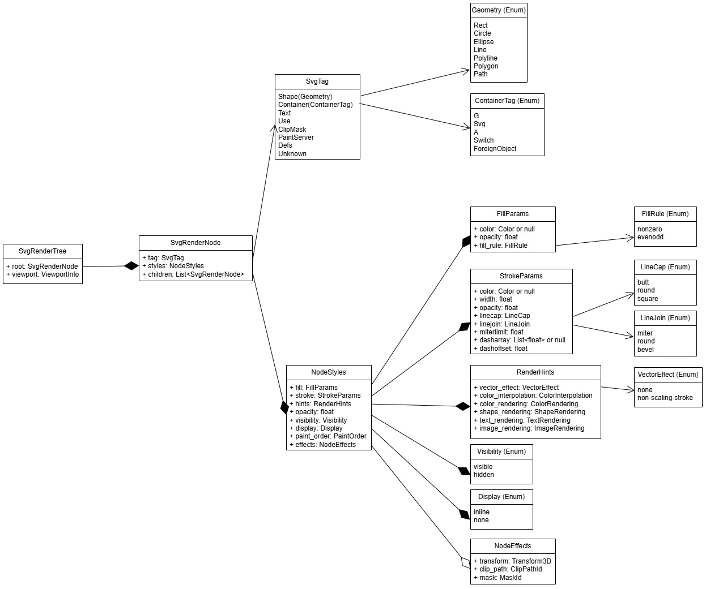

# SVG Engine Design

## Introduction

The SVG engine is a self-contained rendering crate that integrates with the Servo layout system, converting SVG document fragments into WebRender display items for the GPU compositor.

## Table of Contents

1. [System Context](#1-system-context)
2. [Architecture Overview](#2-architecture-overview)
3. [Data Model](#3-data-model)
4. [Crate Structure](#4-crate-structure)
5. [Development Timeline](#5-development-timeline)

## 1. System Context

The SVG engine occupies a defined position in the rendering pipeline, acting as a transformation layer between layout and GPU compositing.

### Components


### Boundaries

- **Layout Integration** — provides fully resolved computed styles from Servo's style system (Stylo). All style values have been computed and cascaded before reaching this layer.
- **svg_engine** — owns the rendering tree and the complete render pipeline. Has no direct access to the DOM or style system. All input arrives as typed data structures.
- **WebRender** — receives only display primitives. The engine never inspects WebRender internals or manages GPU resources directly.

## 2. Architecture Overview

The SVG engine is organized around a core tree-walk loop that traverses the rendering tree, resolves geometry values, manages inherited render state, and dispatches display commands. The architecture separates concerns into four layers.

### Architecture


### Tree Walker (Core)

The tree walker is the central loop of the engine. It receives an `SvgRenderTree` and processes nodes in depth-first order:

### walk_node Flowchart


### Logic
```
walk_node(node, render_state):
    apply node.styles.effects → render_state    // push transform, clip, mask
    resolve node.geometry → concrete values
    dispatch node.tag → render function
    for each child:
        walk_node(child, render_state)
    revert node.styles.effects → render_state   // pop

walk_tree(tree):
    walk_node(tree.root, RenderState::default())
```

## 3. Data Model

The data model is organized as a rendering tree that mirrors the hierarchical structure of SVG elements. Each node in the tree stores only what is unique to its element, while inherited state (transform, clip path, mask) is tracked externally during tree traversal.

### Class Diagram



### SvgRenderTree

`SvgRenderTree` is the top-level container for a single SVG document fragment. It holds the root of the rendering tree and viewport information derived from the element's attributes and the `viewBox`.

```
struct SvgRenderTree {
    root: SvgRenderNode,
    viewport: ViewportInfo,
}
```

| Field | Type | Description |
|---|---|---|
| `root` | `SvgRenderNode` | Root of the rendering tree, corresponding to the outermost `<svg>` element |
| `viewport` | `ViewportInfo` | Resolved viewport dimensions from `width`, `height`, and `viewBox` attributes |

### SvgRenderNode

`SvgRenderNode` represents a single element instance in the rendering tree. Nodes form a recursive tree structure through the `children` field. Each node stores only the data intrinsic to its element — element type, a bundled `NodeStyles` struct with all rendering parameters, and child nodes.

```
struct SvgRenderNode {
    tag: SvgTag,
    styles: NodeStyles,
    children: list of SvgRenderNode,
}
```

| Field | Type | Description |
|---|---|---|
| `tag` | `SvgTag` | Element type discriminant — for shapes, carries the geometry data inline |
| `styles` | `NodeStyles` | Bundled rendering parameters — fill, stroke, effects, opacity, hints, visibility, display, and paint order |
| `children` | `list of SvgRenderNode` | Child nodes in the rendering tree |

## 4. Crate Structure

The `svg_engine` crate (`components/svg_engine/`) is organized into focused modules, each with a single responsibility. The crate root (`src/lib.rs`) declares all modules and re-exports only the types and functions needed by external consumers.

```
svg_engine/
├── src/
|   ├── lib.rs          Crate root — module declarations, public re-exports
│   ├── extract.rs      Extract params from Stylo ComputedValues + DOM attributes
│   ├── lengths.rs      SvgLength type — pixel and percentage resolution
│   ├── path.rs         SVG path data (d attribute) parser
│   ├── points.rs       SVG points attribute parser
│   ├── render.rs       Tree walk, geometry resolution, shape rendering, WebRender dispatch
│   ├── shapes.rs       Element types (SvgTag, Geometry), tree types (SvgRenderNode, SvgRenderTree)
│   ├── styles.rs       Style parameter types (FillParams, StrokeParams, NodeStyles, etc.)
│   └── transform.rs    SVG transform attribute parser
└── Cargo.toml
```

## 5. Development Timeline

**Start date**: May 26, 2026 (Tuesday)  
**End date**: Jul 22, 2026 (Wednesday)  
**Total**: 42 working days (Mon–Fri)

---

| Phase | Duration | Dates |
|-------|----------|-------|
| **Phase 1** — Core Shapes (rect, circle, ellipse, line) | 7 days | May 26 (Tue) → Jun 3 (Wed) |
| **Phase 2** — Path, Polygon, Polyline | 7 days | Jun 4 (Thu) → Jun 12 (Fri) |
| **Phase 3** — Groups, Transforms, viewBox | 7 days | Jun 15 (Mon) → Jun 23 (Tue) |
| **Phase 4** — SVG Text | 7 days | Jun 24 (Wed) → Jul 2 (Thu) |
| **Phase 5** — ClipPath, Mask | 7 days | Jul 3 (Fri) → Jul 13 (Mon) |
| **Phase 6** — Gradients & Filters | 7 days | Jul 14 (Tue) → Jul 22 (Wed) |

---

